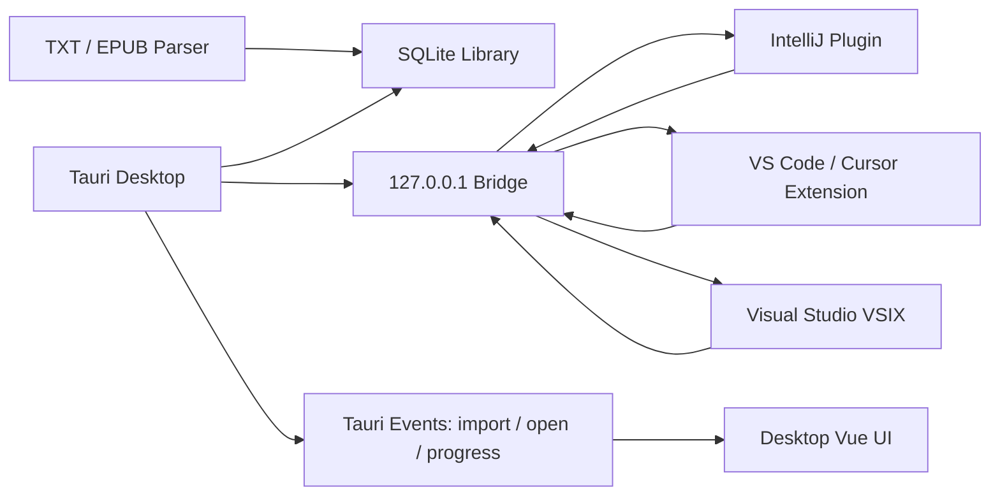

# IDE 小说插件完整技术方案

> 状态：开发分支已完成三端实现、正式制品构建和本机 VS Code/Cursor/IDEA 安装验收；Visual Studio 因本机未安装产品，仅完成官方 VSIX 构建与结构验收
> 更新时间：2026-07-16
> 开发分支：`codex/novel-ide-plugin`
> 首发平台：Windows 10/11

## 1. 文档目的

本文档是桌面端小说插件和 IDE 阅读插件的技术基线。后续编码、测试、打包、发布和版本兼容均以本文档为准。实现摘要见 [`IDE小说插件实施方案.md`](./IDE小说插件实施方案.md)。

本文档记录：

- 产品范围和明确不做的内容。
- 桌面端、Bridge、共享协议和 IDE 插件的边界。
- 数据模型、同步规则和冲突处理。
- 4/5 行紧凑阅读和快捷键行为。
- 安全、隐私、安装、升级和发布策略。
- 测试矩阵、验收条件和当前未完成项。

## 2. 产品目标

用户可以在桌面端维护本地小说书库，也可以在写代码时通过 IDE 插件阅读同一书库中的小说。正文只维护一份，桌面端负责持久化，IDE 插件通过本机 Bridge 读取和回写允许同步的状态。

完整用户流程：

1. 用户在桌面端导入 TXT 或 EPUB。
2. 桌面端解析编码、书名、作者、卷、章节和正文，写入 SQLite。
3. 用户在 IDEA、VS Code、Cursor 或 Visual Studio 中打开小说阅读面板。
4. 插件读取书架和章节，显示完整阅读器或 4/5 行紧凑阅读器。
5. 用户使用方向键、翻页键或自定义 IDE 快捷键阅读。
6. 阅读位置、进度、书签和笔记按同步规则回写桌面端。
7. 用户可以在 IDE 中右键 TXT/EPUB，一键发送给桌面端导入。

## 3. 范围边界

### 3.1 本版本包含

- TXT 和 EPUB 导入、重新解析和去重策略。
- 桌面端书架、章节、搜索、阅读、书签和笔记。
- 4、5、8 行紧凑阅读模式。
- 逐行、逐页、章节切换和自动滚动。
- 本机 Bridge、进度同步、外部导入和打开请求。
- IntelliJ 系列插件。
- VS Code / Cursor 扩展。
- Visual Studio 2022 VSIX 工程。
- 文件拖拽、命令行、文件关联和深链预留。
- IDE 集成安装脚本和 Windows CI 构建流程。

### 3.2 本版本不包含

- 云端账号、跨设备同步和在线书城。
- 在线书源抓取或内置网络小说源。
- AI 摘要、续写、问答或内容生成。
- 插件执行任意脚本或访问 SQLite 文件。
- 通过 IDE 直接编辑正文。
- PDF、MOBI 等未完成解析器的格式。

如果后续需要云同步，应新增独立的账号、服务端、加密和冲突解决设计，不能把本机 Bridge 直接扩展成公网服务。

## 4. 设计原则

1. **桌面端是正文主库**：插件不直接读写 SQLite。
2. **协议优先**：所有 IDE 适配器只依赖 `reader-protocol`，不依赖桌面端内部文件结构。
3. **本地优先**：默认无后端、无账号、无上传。
4. **可恢复**：桌面端关闭、Bridge 重启、插件断线和导入失败都必须可恢复。
5. **显式权限**：路径、请求体、协议版本和写操作都经过校验。
6. **统一阅读语义**：桌面端和 IDE 插件使用相同的行、页、章和进度命令。
7. **不直接复用 Reader 源码**：只参考其单实例、逐行阅读和快捷键交互设计，避免授权和平台耦合风险。

## 5. 总体架构



### 5.1 代码模块

| 模块 | 责任 |
| --- | --- |
| `packages/reader-core` | 领域类型、章节标签、总体进度、紧凑行切分和阅读窗口算法 |
| `packages/reader-protocol` | Bridge DTO、协议版本、事件类型和 URL 工具 |
| `packages/novel-parser` | TXT 编码识别、章节识别、正文清理和解析结果 |
| `apps/desktop/src` | 桌面端 Vue 路由、书架、阅读器、外部导入和状态展示 |
| `apps/desktop/src-tauri/src/database.rs` | SQLite schema、迁移、仓储操作、备份和搜索 |
| `apps/desktop/src-tauri/src/bridge.rs` | 本机 HTTP Bridge、鉴权、请求分发和桌面事件 |
| `plugins/intellij` | IntelliJ Platform Tool Window、Action 和 Bridge 客户端 |
| `plugins/vscode` | VS Code/Cursor 活动栏、TreeView 侧边栏、编辑器 Decoration、命令、快捷键和 Bridge 客户端 |
| `plugins/visual-studio` | Visual Studio 2022 包、VSIX 清单和 C# Bridge 客户端 |
| `scripts/install-ide-plugins.ps1` | Windows IDE 检测和安装入口 |
| `.github/workflows/build-ide-plugins.yml` | Windows 上构建和上传 IDE 插件产物 |

## 6. 桌面端职责

桌面端沿用现有 Tauri 2、Vue 3、Vite 和 SQLite 架构：

- 现有 TXT/EPUB Worker 负责解析，不在 Bridge 线程中重复实现解析器。
- SQLite 继续保存书籍、章节、进度、笔记和备份数据。
- Vue 端监听 Bridge 的导入和打开事件。
- 外部文件通过受限的 `read_external_file` command 读取，限制为 TXT/EPUB 和 512 MB。
- 阅读器支持完整模式和紧凑模式。
- Bridge 在数据库初始化之后启动，避免插件连接到未完成迁移的数据库。

关键文件：

- [`apps/desktop/src/views/ReaderView.vue`](../apps/desktop/src/views/ReaderView.vue)
- [`apps/desktop/src/views/LibraryView.vue`](../apps/desktop/src/views/LibraryView.vue)
- [`apps/desktop/src-tauri/src/lib.rs`](../apps/desktop/src-tauri/src/lib.rs)
- [`apps/desktop/src-tauri/src/database.rs`](../apps/desktop/src-tauri/src/database.rs)
- [`apps/desktop/src-tauri/src/bridge.rs`](../apps/desktop/src-tauri/src/bridge.rs)

## 7. Bridge 设计

### 7.1 发现文件

桌面端启动时在用户安装目录写入：

```text
<安装目录>/bridge.json
```

示例：

```json
{
  "protocolVersion": 1,
  "appVersion": "0.4.0",
  "port": 49321,
  "token": "per-process-bearer-token",
  "pid": 12345,
  "sessionId": "session-id"
}
```

端口从 `49321` 开始尝试，最多寻找 20 个本机端口。token 每次进程启动轮换，插件不能硬编码端口和 token。

### 7.2 HTTP 约束

- 只绑定 `127.0.0.1`，不绑定局域网地址。
- `/v1/health` 可匿名访问，用于判断桌面端是否存活。
- 其余接口必须提供 `Authorization: Bearer <token>`。
- 支持 `OPTIONS`，允许 IDE Webview 的跨域预检。
- 请求头最大 64 KB，请求体最大 2 MB。
- 响应使用 JSON，连接关闭后不复用连接。
- 所有路径参数必须经过白名单校验。
- Bridge 不提供任意命令执行接口。

### 7.3 接口

| 方法 | 路径 | 用途 |
| --- | --- | --- |
| `GET` | `/v1/health` | 检查 Bridge 存活 |
| `GET` | `/v1/manifest` | 获取协议版本、能力和会话信息 |
| `GET` | `/v1/books` | 获取书架 |
| `GET` | `/v1/books/:bookId` | 获取书籍摘要和进度 |
| `GET` | `/v1/books/:bookId/chapters` | 获取章节目录 |
| `GET` | `/v1/books/:bookId/chapters/:number` | 获取章节正文 |
| `POST` | `/v1/progress` | 写入阅读章节和章节进度 |
| `POST` | `/v1/import` | 请求桌面端导入本地 TXT/EPUB |
| `POST` | `/v1/open` | 请求桌面端打开指定书籍和章节 |

### 7.4 请求示例

```json
POST /v1/progress
{
  "bookId": "book-id",
  "chapterNumber": 12,
  "chapterProgress": 42.5
}
```

```json
POST /v1/import
{
  "path": "C:/Books/novel.txt",
  "existingId": null
}
```

导入路径必须是绝对路径、存在的普通文件，并且扩展名为 `txt` 或 `epub`。Bridge 接受后通过 Tauri event 交给桌面端前端解析。

### 7.5 生命周期

- 插件找不到 `bridge.json` 时提示启动桌面端。
- 桌面端重启后 token 变化，插件重新读取发现文件并重连。
- 端口被占用时桌面端使用下一个端口。
- Bridge 无法启动时桌面端启动失败并显示错误，而不是静默降级。
- 插件必须处理 401、404、409、500 和连接超时。
- 协议版本不兼容时提示安装匹配版本的插件。

## 8. 数据模型和同步

现有 `books`、`chapters`、`notes` 表继续作为基础。完整同步模型需要具备以下概念：

```text
bookId
chapterNumber
contentHash
sourceHash
revision
chapterProgress
anchorOffset
paragraphIndex
lineIndex
updatedAt
updatedBy
deletedAt
```

### 8.1 所有权

- 正文：桌面端拥有写权限，插件只读。
- 导入：插件提交路径，桌面端负责解析和写入。
- 阅读进度：桌面端和插件都可写。
- 书签：桌面端和插件都可写，按 ID 合并。
- 笔记：桌面端和插件都可写，冲突保留副本。
- 设置：桌面端保存默认值，插件保存自己的 UI 偏好。

### 8.2 冲突策略

- 阅读进度使用 `updatedAt`，最后一次有效写入胜出。
- 正文使用 `contentHash`，正文改变必须明确选择新建、覆盖或重新解析。
- 书签以稳定 ID 合并，重复位置不重复创建。
- 笔记使用 revision 检测冲突，旧版本保存为副本。
- 删除使用软删除，备份恢复后可以恢复。
- 旧 revision 的写请求返回冲突错误，不允许静默覆盖新数据。

### 8.3 离线缓存

插件可以缓存最近打开的书籍和章节，只读使用。缓存进度在桌面端恢复连接后提交，桌面端返回最终版本后插件更新本地缓存。缓存不作为第二正文主库，也不参与正文编辑。

## 9. 阅读器设计

### 9.1 完整模式

桌面端完整模式保留现有章节阅读体验：

- 完整章节正文。
- TXT 段落渲染。
- EPUB 安全 HTML 渲染。
- 章节前后跳转。
- 章节内滚动进度。
- 字号、行距、主题设置。

### 9.2 紧凑模式

紧凑模式展示 4、5 或 8 个逻辑阅读行，支持：

- 方向键逐行移动。
- PageUp/PageDown 按当前窗口移动。
- 空格键向下移动。
- Escape 退出紧凑模式。
- Ctrl+左/右切换章节。
- 面板宽度和字体变化后尽量保持阅读锚点。

`reader-core` 中的 `splitReaderLines` 负责将文本转换为带起止偏移的行，`getCompactReaderWindow` 根据锚点和可见行数生成窗口。阅读进度至少保存章节号、字符偏移和百分比。

英文字符按半宽估算，中文字符按整宽估算。后续如果需要严格的浏览器物理排版，应增加基于 DOM 测量的前端布局适配器，但不能改变逻辑锚点协议。

### 9.3 富文本规则

- EPUB HTML 必须经过 `sanitize-reader-html` 清理。
- 紧凑模式优先使用 `contentText`，避免在小面板中直接注入复杂 HTML。
- 图片、表格、脚注和链接在紧凑模式中转为可读文本或占位信息。
- 完整模式继续支持安全 HTML、标题、段落、列表、图片和表格。

## 10. 快捷键协议

统一命令名：

```text
reader.toggle
reader.nextLine
reader.previousLine
reader.nextPage
reader.previousPage
reader.nextChapter
reader.previousChapter
reader.toggleCompactMode
reader.toggleAutoScroll
reader.addBookmark
reader.openBook
reader.openDesktop
reader.search
```

IDE 插件快捷键由 IDE Keymap 管理，避免覆盖用户已有配置。桌面端可以提供系统级显示/隐藏热键，但默认快捷键必须允许修改，并处理热键注册失败。

## 11. IDE 适配

### 11.1 IntelliJ

使用 Kotlin + IntelliJ Platform Gradle Plugin。`0.4.5` 使用 Java 17 字节码、`since-build=241` 且不设置上限，一个插件覆盖 IDEA、PyCharm、WebStorm、Android Studio、Rider、CLion、GoLand 和 RubyMine。插件提供 Tool Window、Action、当前文件导入、启动自动加载和 Bridge 客户端；段落模式使用行首固定宽度 Inline Inlay 和编辑器主题色，原 5 行代码行尾 Inlay 作为可切换模式完整保留。阅读会话独立于 Tool Window，方向快捷键只滚动正文或切章，不打开右侧面板；工具栏随宽度自动换行，所有操作始终可见。JetBrains 与 VS Code 使用同一书本轮廓作为插件入口图标。代码内阅读可以独立开启或关闭并持久化，关闭后仍保留选书、章节和进度状态，方向快捷键不会强制重新开启显示。

### 11.2 VS Code / Cursor

使用 CommonJS 扩展。`0.4.5` 提供活动栏与分层侧边栏：书架默认展开，章节目录可折叠，正文默认展开并固定展示当前 5 行；当前书籍和章节有明确标记，点击条目即可切换。显示隐藏、逐行、切章、刷新和段落/行尾模式切换使用视图标题栏 Codicon，原有行尾模式完整保留。段落模式在当前代码列起点显示完整自然段落，使用编辑器主题正文色和背景色，不添加 `//` 或斜体提示。命令与快捷键继续保留但不再占用阅读内容区域。编辑器通过 Decoration 混入 5 行小说，状态栏同步显示阅读位置。Cursor 复用 VS Code 扩展协议。

### 11.3 Visual Studio

使用 Visual Studio 2022 VSIX 工程和 C# Bridge 客户端。`0.4.5` 提供 WPF 工具窗口、书籍/章节选择、5 行阅读、快捷键和编辑器 `IAdornmentLayer`；段落模式使用编辑器主题字体、前景和背景绘制固定宽度正文层，原行尾 Adornment 作为可切换模式完整保留。代码内阅读开关与显示模式均持久化，关闭显示不会清空阅读会话。VSSDK 生成正式 `.pkgdef` 和命令表，`scripts/package-visual-studio-plugin.ps1` 只验证官方 VSIX，不再自行压缩伪造扩展包。

## 12. 一键安装和导入

### 12.1 安装

正式桌面安装包必须随包提供三个已经由 CI 构建的插件产物，并通过 Tauri resources 放入 `ide-plugins` 资源目录：

```text
novel-library-reader-0.4.5.vsix
novel-library-intellij-0.4.5.zip
novel-library-visual-studio-0.4.5.vsix
manifest.json
```

桌面端“工具 -> IDE 插件”页面检测本机 IDE，每个 IDE 单独显示安装按钮，用户自主选择目标，不自动安装到所有 IDE。

源码仓库同时提供 `scripts/install-ide-plugins.ps1` 作为命令行入口。默认运行时先让用户选择目标 IDE，也可以通过 `-Only` 指定插件类型：

```powershell
.\scripts\install-ide-plugins.ps1 -Only VSCode
.\scripts\install-ide-plugins.ps1 -Only JetBrains
.\scripts\install-ide-plugins.ps1 -Only VisualStudio
.\scripts\install-ide-plugins.ps1 -Only VSCode -SkipBuild -AllTargets
```

安装器行为：

- 检测 `code` 命令和 VS Code/Cursor。
- 如果同时检测到 VS Code 和 Cursor，让用户选择安装到哪一个或全部。
- 检测 Visual Studio 的 `VSIXInstaller.exe`。
- 检测 JetBrains Toolbox、Program Files 下的 IDE，并让用户选择具体产品或全部产品。
- JetBrains 使用目标 IDE 官方 `installPlugins <zip>` 安装、`uninstallPlugins <pluginId>` 卸载，不自行解压或删除插件目录。
- 所有外部检测和 CLI 安装进程在 Windows 上使用隐藏窗口标志，不弹命令行窗口。
- 已安装版本从 VS Code/Cursor 扩展目录或 JetBrains 插件 JAR 的 `META-INF/plugin.xml` 读取；页面展示版本和卸载操作，不重复显示安装。
- 安装失败时显示具体原因，不删除用户现有插件。
- IDE 仍可能因为权限和安全策略显示确认窗口。

### 12.2 导入

```text
IDE 右键 TXT/EPUB
    -> POST /v1/import
    -> 桌面端校验路径
    -> 解析 Worker 处理
    -> SQLite 写入
    -> 返回或打开 bookId
```

导入重复时由桌面端决定新建、覆盖或使用 existingId 更新，插件不自行修改数据库。

## 13. 深链、文件关联和单实例

目标协议：

```text
novellibrary://read?bookId=<id>&chapter=12
novellibrary://open
```

桌面端还应支持命令行打开 TXT/EPUB，并使用单实例转发将第二次启动的路径交给现有窗口。此部分发布前需要补充 Tauri deep-link/file-association 插件配置和 Windows 安装器验证。

## 14. 安全和隐私

- 默认完全本地运行，不上传正文。
- Bridge 只绑定回环地址。
- token 每次进程启动轮换。
- Bridge 文件写入安装目录；插件通过运行中的 NovelLibrary 进程定位安装目录，旧用户数据目录仅作为兼容回退。
- 导入只允许 TXT/EPUB 绝对文件路径。
- 不提供任意文件读取以外的系统命令执行能力。
- 不允许插件直接拼接 SQL。
- HTML 内容进入阅读器前必须清理。
- 错误日志不得写入正文内容和 token。
- 发行说明中明确本地书籍版权责任。
- `Reader` 仅作为行为参考，不复制其源码和网络书源。

## 15. 版本和发布

桌面端、协议和插件分别维护版本：

```text
desktopVersion
protocolVersion
pluginVersion
supportedIdeVersions
```

协议不兼容时必须提高协议主版本。桌面端可以兼容旧协议一个大版本，插件启动时通过 `/v1/manifest` 检查能力。

发布产物：

- Tauri Windows NSIS 安装包。
- JetBrains 插件 ZIP。
- VS Code/Cursor VSIX。
- Visual Studio VSIX。
- SHA-256 校验值。
- 安装说明和变更说明。

发布顺序：

1. 仓库自动化测试通过。
2. Windows CI 构建三类 IDE 适配器。
3. 干净 Windows 虚拟机安装桌面端。
4. 安装三个插件并验证 Bridge 配对。
5. 验证导入、阅读、快捷键、进度、断线重连和卸载。
6. 合并 `develop`。
7. 构建签名安装包并生成 Release 清单。

## 16. 测试矩阵

### 16.1 仓库内测试

```powershell
npm test
npm run desktop:web:build
npm run plugins:validate
node --check plugins/vscode/extension.js
node --check plugins/vscode/bridge.js
dotnet build plugins/visual-studio/NovelLibrary.VisualStudio.csproj -c Release
gradle clean buildPlugin
```

```powershell
cd apps/desktop/src-tauri
cargo fmt --all -- --check
cargo test
```

### 16.2 功能测试

- TXT 编码和章节解析。
- EPUB 目录、HTML 清理和图片降级。
- 4/5/8 行窗口切换。
- 锚点恢复和字号变化。
- 上下行、翻页和章节切换。
- Bridge token、非法路径、非法 bookId 和超大请求。
- 桌面端重启和端口变化。
- 插件断线和缓存恢复。
- 多个 IDE 同时连接。
- 自动过滤 `frontmatter` 和 `volume`，从 `kind=chapter` 的正文开始；旧数据无 `kind` 时兼容保留。
- Bridge 请求最长 5 秒，VS Code/Cursor 请求使用 `Connection: close`，避免桌面端重启时复用失效连接；扩展启动连接采用有限后台重试，处理 Bridge 状态文件已刷新但服务尚未完全就绪的竞态，重试过程不连续弹错。
- 重复导入和 existingId 更新。
- 书签、笔记和进度同步。

### 16.3 发布机测试

- JetBrains ZIP 真实构建、安装、启动和卸载。
- VS Code/Cursor VSIX 真实安装。
- Visual Studio 2022 VSIX 真实构建、安装和卸载。
- 中文路径、空格路径、长路径。
- 1080p、4K、多显示器和高 DPI。
- 桌面端升级后数据库迁移和插件协议兼容。
- 安装器失败和回滚。

## 17. 当前实现状态

已完成：

- `codex/novel-ide-plugin` 独立分支。
- Bridge、token、动态端口和核心接口。
- 桌面端紧凑阅读和外部导入事件。
- `reader-protocol` 和 `reader-core` 紧凑行算法。
- 桌面端与三个 IDE 插件独立维护版本；插件只有自身代码或协议发生兼容性变更时才升级。当前桌面端为 `0.5.0`，三个插件制品为 `0.4.5`，两者不是发布约束。
- Windows IDE 插件 CI 工作流。
- 桌面端完整插件目录、搜索、逐 IDE 安装/卸载、安装状态和版本展示。
- JetBrains 官方 `installPlugins` / `uninstallPlugins`、JAR 元数据检测和 VS Code/Cursor 官方 CLI 版本检测。
- VS Code/Cursor 安装状态以各自 CLI 扩展清单为准，避免旧版本目录残留造成假安装；检测、安装和卸载统一调用官方 `.cmd`，不解析、不拼接、也不直接传入 `cli.js`，且命令返回后必须复检。
- Visual Studio 官方 VSIX 构建，包含扩展清单、主 DLL、`.pkgdef`、命令表注册和 MEF 组件，构建为 0 警告。
- 本机 VS Code `1.129.0`、Cursor `3.5.17` 安装 `0.4.2` 成功；隔离扩展宿主连接真实 Bridge，验证 `诡秘之主 / 绯红 / 5 行` 和逐行前移。
- VS Code/Cursor `0.4.3` 分层阅读器已安装到两个真实 IDE；自动验收覆盖书架、章节、正文 5 行、树节点直接切换、逐行移动和桌面 Bridge 冷启动重试。最终 NSIS 隔离安装确认内置 VSIX 与资源目录哈希一致，卸载清理完整。
- 本机 IntelliJ IDEA `2025.3.2` 安装 `0.4.1` 成功；独立启动日志记录 `Loaded custom plugins: 小说书库阅读器 (0.4.1)`，无插件类加载错误。
- 本机 IntelliJ IDEA `2025.3.2` 安装 `0.4.2` 成功；真实验证中文 CJK 字体回退、段落/行尾模式、关闭面板后的逐行快捷键、快捷键不展开 Tool Window、响应式换行工具栏和统一书本图标。最终 ZIP 经强制 `clean buildPlugin` 生成，并与桌面端内置资源及本地发布目录保持相同 SHA-256。
- 本机 NSIS `0.3.2` 静默安装到隔离目录后，`resources/ide-plugins` 中存在清单和三份准确版本的插件；自带卸载器退出码为 0 且完整清理隔离目录。

待发布前完成：

- 在安装 Visual Studio 2022 的 Windows 环境真实安装、打开工具窗口、验证行尾 Adornment 和卸载；当前机器没有 Visual Studio/VSIXInstaller，不能伪报该项通过。
- 补齐 Tauri deep-link 和 Windows 文件关联配置。
- 做干净 Windows 环境的端到端安装验收。
- 确认插件平台许可证、签名证书和最终发布渠道。

在上述待办完成前，不合并到 `develop`，不生成正式发布包。

## 18. 决策记录

| 日期 | 决策 |
| --- | --- |
| 2026-07-16 | 使用 Tauri 本机 Bridge，不让 IDE 直接访问 SQLite。 |
| 2026-07-16 | JetBrains 系列使用一个 IntelliJ Platform 插件。 |
| 2026-07-16 | 正文由桌面端维护，插件只回写进度、书签和笔记。 |
| 2026-07-16 | 4/5 行阅读使用字符锚点和逻辑行窗口，不使用易漂移的纯百分比。 |
| 2026-07-16 | JetBrains 和 Visual Studio 的真实构建交给 Windows CI 验收。 |
| 2026-07-16 | 不直接复用 `binbyu/Reader` 源码，只参考交互设计。 |
| 2026-07-16 | JetBrains 本地 ZIP 按 `product-info.json` 精确部署到产品插件目录，不使用仅支持 Marketplace ID 的 `installPlugins` 命令。 |
| 2026-07-16 | IDE 自动阅读只选择 `kind=chapter`，避免把封面、制作说明、简介和分卷标题显示成正文。 |
