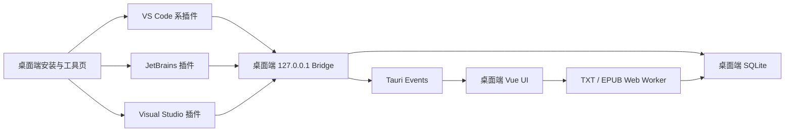
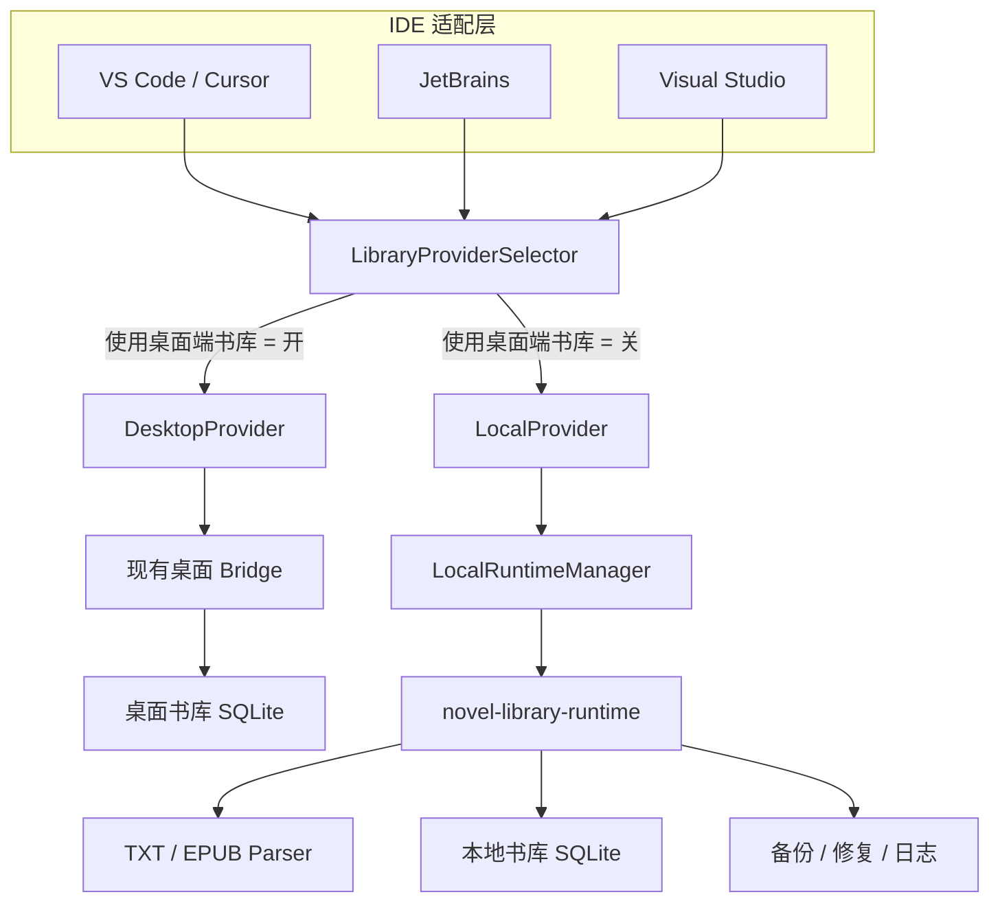
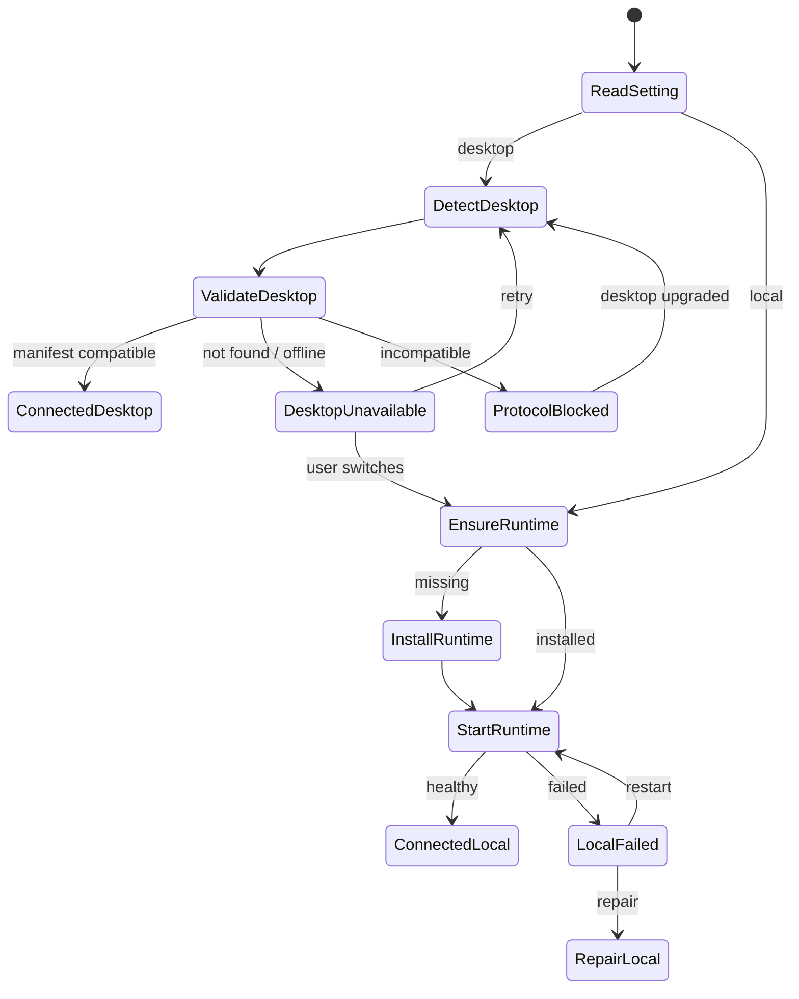

# IDE 插件独立运行与桌面端双模式完整方案

> 状态：独立运行核心、三端本地安装包与本机安装验收已完成；市场签名/上架需发布凭证
> 更新时间：2026-09-02
> 适用版本：NovelLibrary 0.6.9 及后续版本
> 当前正式平台：Windows 10/11 x64
> 关联文档：[`IDE小说插件完整技术方案.md`](./IDE小说插件完整技术方案.md)、[`IDE小说插件实施方案.md`](./IDE小说插件实施方案.md)、[`桌面端架构设计方案.md`](./桌面端架构设计方案.md)

## 1. 文档目的

本文档定义 NovelLibrary 三套 IDE 插件脱离桌面端后独立安装、独立运行和自我维护的完整技术方案，并保留与现有桌面端书库连接的兼容模式。

覆盖范围包括：

- 当前插件对桌面端的强依赖盘点。
- 桌面托管与本地自治双模式的产品语义。
- 共享本地 Runtime 的模块边界和生命周期。
- Bridge 协议升级、服务发现、鉴权和兼容策略。
- 本地书库、TXT/EPUB 导入、进度并发、备份恢复和数据迁移。
- VS Code、JetBrains、Visual Studio 三端的具体改造。
- 插件市场独立发布、Runtime 更新、签名和卸载策略。
- 安全、诊断、测试、验收标准和分阶段实施计划。

本文档是独立化工作的技术基线。实施阶段如需改变数据所有权、切换语义、Runtime 分发方式或协议兼容规则，必须先更新本文档。

### 1.1 本次一次性交付结果

本方案的独立运行核心能力已在同一版本中完整落地，没有把 VS Code、JetBrains、Visual Studio 或数据目录能力拆成后续版本：

- 三端插件统一为 `0.5.2`，均内嵌 `novel-library-runtime 1.0.1`，可以脱离桌面端安装和离线运行。
- 三端均提供“桌面书库 / 本地书库”显式开关；桌面模式自动发现原 Bridge，本地模式自动发现、拉起和恢复共享 Runtime。
- 三端均支持用户自定义本地数据目录，切换目录前安全关闭 Runtime、创建迁移锁并复制现有书库；目录迁移后持久化 `storageId` 不变。
- 本地 Runtime 提供 SQLite、TXT/EPUB 安全解析、受管源文件、后台导入任务、重新解析、删除、进度 revision、备份恢复、诊断、单实例锁和崩溃恢复。
- 三端提供“保留受管源文件”开关；关闭后只保存数据库正文和原始路径，不额外占用源文件副本空间。
- 三端会把已校验 Runtime 安装到共享 `versions/<runtimeVersion>` 目录，通过 `install.lock`、`active.json`、防降级检查和 `previousVersion` 回滚元数据协调并发升级。
- 三端均提供导入、备份、恢复/迁移、删除、重新解析和诊断入口；覆盖恢复会先自动备份当前本地书库。
- 桌面端保留旧 `/v1` 行为并增加 v2 manifest 与迁移接口，可以用统一备份在桌面书库和本地书库之间显式迁移。
- CI 每次从当前源码构建 Runtime 和三端插件，不复用同名旧制品，并校验安装包内必须存在非空 Runtime。

此前本机最终验收结果：VS Code 0.5.2 在全新隔离用户目录安装、自动安装共享 Runtime 1.0.1，并真实导入《斗破苍穹》得到 `3 frontmatter + 1646 chapter`；IntelliJ IDEA 2025.3.2 从最终 ZIP 隔离部署，日志确认加载插件 0.5.2，并从同一共享版本目录启动 Runtime 1.0.1；Visual Studio 构建、VSIX 结构和 VSIXInstaller 解析通过，但本机只有不支持扩展的 Build Tools SKU，无法完成 IDE 内启动验收。当次 Runtime SHA-256 为 `b1c587c6a09f02f1ca9860b6fdd6c72d52e3d297513618b1d4611e0d705f6162`；本轮安全合并、存储身份与协议兼容优化后重新构建的 Runtime SHA-256 为 `a19f896acbabafc1f8e66774bab9970fd6bac5becc449ccddecfa7d426115a9a`，已通过 Runtime 单元测试、Clippy 和二进制 E2E，三端完整安装实验室矩阵需在正式发布前重跑。

不应把“代码已经支持独立安装”与“市场运营已经完成”混为一谈。当前本地包未使用正式 Authenticode/Marketplace 证书签名，VSIXInstaller 会如实显示 `Unsigned`；正式签名、上传三大市场/Open VSX 和 Windows 10/各 IDE SKU 的完整实验室矩阵需要仓库外发布凭证及对应测试机，不在源码内伪造完成状态。

当前正式制品只承诺 Windows x64。Windows arm64、macOS、Linux、云同步和在线书源不属于本次独立运行交付范围，插件会对不支持的平台给出明确提示。

## 2. 核心结论

插件独立化不采用“三套插件分别内置数据库和解析器”的方案，而采用一个由插件按需安装和启动、三套 IDE 共用的本地书库 Runtime。

插件负责：

- IDE 原生界面、编辑器装饰、快捷键和状态展示。
- “使用桌面端书库”开关和数据源选择。
- 桌面 Bridge 或本地 Runtime 的发现、连接和重连。
- 本地 Runtime 的安装、拉起、升级和诊断入口。

本地 Runtime 负责：

- SQLite 数据库、schema 迁移和并发写入。
- TXT/EPUB 解析、导入任务、重新解析和源文件维护。
- 书架、章节、阅读进度、备份恢复和数据修复。
- 本机协议服务、鉴权、进程互斥和运行状态。
- 多 IDE 实例共享同一份本地书库。

桌面端与本地 Runtime 是两个独立数据源。两者不直接共用 SQLite 文件，不做隐式双向同步；数据迁移必须由用户显式触发。

## 3. 当前架构与依赖盘点

### 3.1 当前调用链



### 3.2 桌面端当前承担的职责

| 职责 | 当前实现 | 对独立化的影响 |
| --- | --- | --- |
| 服务进程 | 桌面端数据库初始化完成后启动 Bridge | 未启动桌面端时插件没有服务可连接 |
| 服务发现 | 桌面进程附近或旧版 `%APPDATA%/NovelLibrary/bridge.json` | 插件需要扫描桌面进程，缺少稳定的统一发现入口 |
| 鉴权 | 每次桌面进程启动生成临时 token | 桌面重启后插件必须重新读取发现文件 |
| 数据持久化 | Rust + SQLite，当前 schema 版本为 6 | 插件本身没有书库和迁移能力 |
| TXT 解析 | `@novel-library/novel-parser` + Web Worker | IntelliJ 和 Visual Studio 无法直接复用浏览器 Worker |
| EPUB 解析 | 桌面端 EPUB Web Worker | 插件独立模式缺少 EPUB 解包、清洗和封面处理 |
| 导入调度 | Bridge 发出 Tauri Event，由桌面 Vue UI 解析并保存 | `/v1/import` 并不是独立的后台导入服务 |
| 进度保存 | Bridge 直接更新 `books` 表 | 缺少 revision、clientId 和并发冲突控制 |
| 插件安装 | 桌面端检测 IDE 并安装、卸载三套制品 | 离开桌面端后需要插件市场和独立制品发布 |
| 增强滚轮 | 桌面端修改 VS Code 系工作台文件并负责恢复 | 独立模式需要迁移该维护能力或暂不提供 |

### 3.3 三套插件的当前能力边界

三套插件当前都只实现 Bridge 客户端和阅读界面：

- 读取书架、书籍、章节目录和章节正文。
- 保存当前章节和章节百分比。
- 把当前 TXT/EPUB 路径发送给桌面端导入。
- 保存显示模式和代码内阅读开关。
- 在连接失败时进行有限重试。

当前没有以下独立能力：

- 创建和迁移本地数据库。
- 自己解析并保存 TXT/EPUB。
- 删除、重新解析、备份或恢复本地书库。
- 维护稳定的本地服务进程。
- 校验 Bridge manifest 和协议版本。
- 独立发布和自动更新 Runtime。
- 在多个 IDE 之间协调数据库写入。

### 3.4 当前协议与实现差距

`packages/reader-protocol` 已声明 `READER_PROTOCOL_VERSION`、manifest、书籍、章节和进度 DTO，但三套原生插件各自手写 DTO，并未统一生成客户端，也没有在连接前调用 `/v1/manifest` 做版本协商。

当前 `/v1/import` 只接受路径并发送桌面事件，响应中的 `accepted: true` 只表示请求已进入桌面事件通道，不表示文件已经解析或保存成功。

当前进度写入只提交：

```text
bookId
chapterNumber
chapterProgress
```

虽然共享协议中预留了 `anchorOffset`、`lineIndex` 和 `updatedAt`，数据库写入并未使用这些字段，也没有 revision 检查。多个 IDE 同时阅读同一本书时，最终状态取决于最后一次数据库写入顺序。

## 4. 建设目标与非目标

### 4.1 建设目标

1. 用户只安装任意一套 IDE 插件，即可导入小说、维护本地书库和阅读，不要求安装桌面端。
2. 用户可以通过一个明确开关选择桌面书库或本地书库。
3. VS Code、JetBrains 和 Visual Studio 在本地模式下共享同一份书库和阅读进度。
4. 插件升级可以安全升级 Runtime，不覆盖数据，不允许旧插件把 Runtime 降级。
5. 桌面端模式保持与现有用户兼容，桌面重启后可以自动重连。
6. 桌面与本地数据源可以通过版本化备份显式迁移。
7. 无论桌面端是否安装，本地模式都能离线工作。
8. Runtime 崩溃、发现文件损坏、端口占用和数据库迁移失败时均有可理解、可恢复的处理路径。

### 4.2 首发非目标

- 不做桌面书库与本地书库的实时双向同步。
- 不做云账号、跨设备同步和在线书城。
- 不允许多个服务进程直接打开并迁移同一个 SQLite 文件。
- 不要求首发版本在 IDE 内完整复刻桌面端笔记编辑器。
- 不要求首发版本支持 PDF、MOBI 或在线书源。
- 不在首发版本强制提供 VS Code 增强滚轮注入。
- 不因为桌面端暂时离线而静默切换到本地空书库。

## 5. 设计原则

1. **单一写入者**：每一份书库同时只允许一个 Runtime 或桌面服务负责数据库迁移和写入。
2. **数据源显式**：界面始终显示当前连接的是“桌面书库”还是“本地书库”。
3. **协议优先**：IDE 适配层只依赖协议，不依赖 SQLite 文件结构。
4. **三端共用**：存储、解析、迁移和备份不在三套插件中重复实现。
5. **本地优先**：所有正文默认只保存在用户本机，不上传网络。
6. **可恢复**：服务、升级、导入和迁移失败均可重试或回滚。
7. **不静默混库**：切换数据源、导入备份或覆盖书籍必须明确提示。
8. **向后兼容**：新插件可以继续连接现有协议版本 1 的桌面端。
9. **最小权限**：Runtime 只绑定本机，只读取用户明确选择或导入的文件。
10. **离线可安装**：正式插件包应包含当前平台 Runtime，不把首次启动建立在网络下载成功之上。

## 6. 方案选型

### 6.1 方案比较

| 方案 | 优点 | 缺点 | 结论 |
| --- | --- | --- | --- |
| 每套插件各自内置存储与解析 | 单个插件内部看似简单，VS Code 可以快速复用 TypeScript | 三种语言重复实现；形成三份书库；迁移和行为容易不一致 | 不采用 |
| 安装一个强制常驻的独立 Windows 服务 | 生命周期统一，多 IDE 共享自然 | 安装权限重；插件不能真正单独安装；卸载复杂 | 不采用 |
| 插件携带并按需启动共享 Runtime | 独立安装；多 IDE 共用；可以复用统一协议；无需管理员权限 | 需要解决进程仲裁、版本选择和二进制分发 | 采用 |
| 直接让插件打开桌面 SQLite | 初期开发量小 | schema 耦合、锁冲突、迁移冲突、安全和兼容风险高 | 严禁采用 |

### 6.2 最终决策

新增一个用户级、按需运行的 `novel-library-runtime` 可执行程序。三套插件都携带对应平台的 Runtime 制品，在首次进入本地模式或发现兼容 Runtime 不存在时，将制品原子解压到共享目录并启动。

Runtime 使用现有 Bridge 的 HTTP/JSON 语义，以降低三端改造成本；后续可以在 Windows 上增加 Named Pipe 传输，但领域协议和 DTO 保持不变。

## 7. 目标总体架构



### 7.1 模块边界

| 模块 | 责任 |
| --- | --- |
| `LibraryProviderSelector` | 读取用户模式、建立对应 Provider、切换和状态展示 |
| `DesktopProvider` | 发现现有桌面 Bridge、版本协商、请求和重连 |
| `LocalProvider` | 确保 Runtime 可用后复用相同领域接口 |
| `LocalRuntimeManager` | Runtime 安装、版本选择、启动、健康检查和诊断 |
| `novel-library-runtime` | 协议服务、书库、解析、任务和备份 |
| `library-store` | SQLite schema、迁移、仓储、备份和一致性检查 |
| `library-parser` | TXT/EPUB 解析和解析结果标准化 |
| `reader-protocol` | TypeScript DTO、能力标识、错误码和兼容规则；三端原生 DTO 由源码契约校验约束 |

### 7.2 实际代码结构

```text
apps/
  local-runtime/
    Cargo.toml
    src/main.rs
  desktop/
    src-tauri/src/bridge.rs
    src-tauri/src/database.rs
packages/
  reader-protocol/
plugins/
  vscode/
    bridge.js
    extension.js
  intellij/
    .../NovelLibraryPlugin.kt
  visual-studio/
    NovelLibraryBridge.cs
    NovelLibraryLocalSettings.cs
```

当前 Runtime 是独立 Rust 二进制，不加载桌面 UI、Node.js 或浏览器 Worker。桌面库与本地库不直接共用数据库文件；两端通过相同的 v4 备份结构做显式迁移。协议契约由 `packages/reader-protocol` 和 IDE 集成校验脚本共同约束。

## 8. 双模式产品与状态机

### 8.1 开关定义

统一设置项：

```text
使用桌面端书库
```

内部配置：

```json
{
  "libraryMode": "desktop"
}
```

允许值：

- `desktop`：开关开启，使用桌面端书库。
- `local`：开关关闭，使用本地 Runtime 书库。

不增加会静默回退的 `auto` 模式。所谓“自动检测桌面端”只表示桌面模式会自动发现、验证和重连桌面 Bridge，不表示发现失败后自动改用本地数据。

### 8.2 默认值

- 从旧版插件升级：默认 `desktop`，保持现有行为。
- 旧版升级和全新安装都保持安全默认值 `desktop`，不在后台静默切换数据源。
- 未检测到桌面端时，固定状态区明确显示离线，并提供“一键切换本地书库”入口；这是推荐而不是自动改写设置。
- 用户一旦显式选择模式，插件后续不再自动修改。

### 8.3 启动状态机



### 8.4 桌面模式行为

1. 从稳定 locator、正在运行的桌面进程和旧版路径依次寻找桌面 Bridge。
2. 调用 `/v1/health`，再调用 `/v1/manifest`。
3. 验证协议版本、provider 类型、能力和 session。
4. token 失效、401 或连接重置时重新读取发现文件并重试一次。
5. 桌面端未运行时展示：
   - 启动桌面端。
   - 重新连接。
   - 切换到本地书库。
6. 不清空当前只读画面；可以展示最近成功读取的章节缓存，但必须标记“桌面书库离线”。

### 8.5 本地模式行为

1. 检查活动 Runtime 和协议兼容性。
2. 如不存在，解压插件携带的 Runtime 到版本目录。
3. 通过用户级互斥锁选出唯一活动进程。
4. 启动 Runtime，等待发现文件和 health 就绪。
5. 初始化或迁移本地数据库。
6. 加载书架；空书架时提供“浏览文件导入”和“从桌面复制”。
7. Runtime 意外退出时最多自动重启三次，再进入诊断状态。

### 8.6 切换数据源

切换前必须：

1. 停止发起新的阅读写入。
2. 等待当前 Provider 的进度写入队列完成。
3. 如写入失败，将待写记录保留在对应 Provider 的队列中，不投递到新 Provider。
4. 释放旧连接和订阅。
5. 建立新 Provider，清空内存中的书籍和章节对象。
6. 按新 `storageId` 加载对应缓存。
7. 更新状态栏和书架来源标识。

所有缓存、待写队列和最近阅读状态必须使用以下复合键隔离：

```text
providerType + storageId + bookId
```

禁止只使用 `bookId`，因为桌面书库和本地书库可能存在相同 UUID。

## 9. 本地 Runtime 设计

### 9.1 运行形态

Runtime 是普通用户权限的后台进程，不注册 Windows Service，不要求管理员权限，不显示主窗口。

启动示例：

```text
novel-library-runtime.exe serve
  --data-dir <path>
  --port 0
```

诊断命令：

```text
novel-library-runtime.exe doctor --data-dir <path>
novel-library-runtime.exe version
```

### 9.2 目录约定

Windows 默认目录：

```text
%LOCALAPPDATA%\NovelLibrary\
  local-data\
    library.db
    library.db-wal
    library.db-shm
    sources\
    backups\
    logs\
    local-runtime.json
```

目录规则：

- Runtime 程序与用户数据分离。
- 插件卸载不得默认删除 `local-data`。
- `storageId` 保存在数据库元数据中，复制切换数据目录后保持稳定。
- 备份使用临时文件写完后原子重命名。
- `discovery` 和 `local-data` 仅允许当前 Windows 用户访问。

### 9.3 单实例与多客户端

Runtime 使用每个数据目录中的 `runtime.lock` 做原子单实例仲裁，并保留 PID 用于异常退出恢复。处理规则：

1. 第一个插件获得互斥锁并启动 Runtime。
2. 后续插件发现锁已存在，等待 discovery 文件并连接现有 Runtime。
3. discovery 指向的 PID 不存在或 health 失败时，竞争恢复锁。
4. 只有获得恢复锁的客户端可以清理失效 discovery 并重启服务。
5. SQLite 启用 WAL、外键和 busy timeout；进度更新使用 `IMMEDIATE` 事务，导入与恢复使用完整事务。

### 9.4 共享驻留与退出

Runtime 可以被多个 IDE 实例共享，因此关闭单个 IDE 不会直接终止共享进程。用户显式重启 Runtime 或迁移数据目录时，插件通过鉴权接口请求安全退出；异常退出会留下 discovery，下一客户端经过 health、manifest、`storageId` 和数据目录校验后自动恢复。

### 9.5 服务发现文件

`local-runtime.json` 示例：

```json
{
  "schemaVersion": 1,
  "providerType": "local",
  "protocolVersion": 2,
  "runtimeVersion": "1.0.1",
  "port": 49341,
  "token": "per-process-token",
  "pid": 12345,
  "sessionId": "a-session-id",
  "storageId": "stable-local-library-id",
  "startedAt": 1785753600000
}
```

要求：

- 使用临时文件加原子重命名写入。
- token 每次 Runtime 进程启动轮换。
- Runtime 正常退出时删除 discovery；异常退出由下一个客户端验证 PID 和 health 后清理。
- 不在 discovery 中暴露数据库绝对路径。
- 插件不能只相信 PID，必须同时验证 health、session 和 manifest。

### 9.6 端口与传输

首发继续使用 `127.0.0.1` HTTP，以复用现有三端客户端。

- 端口由操作系统分配，优先绑定 `127.0.0.1:0`，不再依赖固定 20 个端口窗口。
- 不绑定 `0.0.0.0`、IPv6 全局地址或局域网地址。
- 限制请求头、请求体、读取时间和并发连接数。
- 原生 IDE 客户端不需要通配 CORS；本地 Runtime 默认不返回 `Access-Control-Allow-Origin: *`。
- 后续增加 Named Pipe 时，HTTP 与 Pipe 共享同一领域处理器。

## 10. 协议升级方案

### 10.1 版本策略

- 保留现有 `/v1` 读书和进度接口，保证新插件可以连接旧桌面端。
- 新增 `/v2` 能力，用于 Provider 身份、导入任务、维护、备份和冲突控制。
- 新插件必须先读取 manifest，再根据 capabilities 启用功能。
- 协议大版本不兼容时拒绝写入，但可以在确认 DTO 兼容时保留只读降级。

### 10.2 Manifest

```json
{
  "protocolVersion": 2,
  "minimumClientProtocolVersion": 1,
  "providerType": "local",
  "providerVersion": "1.0.1",
  "providerId": "novel-library-local-runtime",
  "storageId": "stable-local-library-id",
  "schemaVersion": 1,
  "sessionId": "session-id",
  "capabilities": [
    "books.read",
    "books.delete",
    "chapters.read",
    "progress.v2",
    "import.jobs",
    "import.idempotency",
    "books.reparse",
    "backup.transfer",
    "runtime.diagnostics",
    "runtime.check-database",
    "epub.structure.v2"
  ]
}
```

桌面端 manifest 的 `providerType` 为 `desktop`，本地 Runtime 为 `local`。

### 10.3 接口清单

兼容接口：

| 方法 | 路径 | 用途 |
| --- | --- | --- |
| `GET` | `/v1/health` | 基础存活检查 |
| `GET` | `/v1/manifest` | 协议和能力 |
| `GET` | `/v1/books` | 书架 |
| `GET` | `/v1/books/:bookId` | 书籍详情和进度 |
| `GET` | `/v1/books/:bookId/chapters` | 章节目录 |
| `GET` | `/v1/books/:bookId/chapters/:number` | 章节正文 |
| `POST` | `/v1/progress` | 旧版进度写入 |

新增接口：

| 方法 | 路径 | 用途 |
| --- | --- | --- |
| `GET` | `/v2/health` | 数据库、任务队列和运行状态 |
| `GET` | `/v2/manifest` | 完整 Provider manifest |
| `POST` | `/v2/progress` | 带 revision 和客户端信息的进度写入 |
| `POST` | `/v2/import-jobs` | 创建 TXT/EPUB 导入任务 |
| `GET` | `/v2/import-jobs/:jobId` | 查询任务进度和结果 |
| `DELETE` | `/v2/import-jobs/:jobId` | 取消等待中或解析中的任务 |
| `DELETE` | `/v2/books/:bookId` | 删除书籍和受管源文件 |
| `POST` | `/v2/books/:bookId/reparse` | 使用保存的源文件重新解析 |
| `POST` | `/v2/transfers/export` | 导出版本化迁移包 |
| `POST` | `/v2/transfers/import` | 导入迁移包 |
| `GET` | `/v2/runtime/status` | Runtime、数据目录和诊断摘要 |
| `POST` | `/v2/runtime/check-database` | 执行只读一致性检查 |
| `POST` | `/v2/runtime/restart` | 请求当前 Runtime 安全退出，由插件重启 |

### 10.4 统一错误结构

```json
{
  "error": {
    "code": "IMPORT_SOURCE_NOT_FOUND",
    "message": "导入文件不存在或已被移动",
    "retryable": false,
    "requestId": "request-id",
    "details": {}
  }
}
```

错误码至少包括：

```text
UNAUTHORIZED
PROTOCOL_INCOMPATIBLE
CAPABILITY_UNAVAILABLE
BOOK_NOT_FOUND
CHAPTER_NOT_FOUND
PROGRESS_CONFLICT
IMPORT_INVALID_FORMAT
IMPORT_SOURCE_NOT_FOUND
IMPORT_TOO_LARGE
IMPORT_PARSE_FAILED
DATABASE_BUSY
DATABASE_CORRUPTED
MIGRATION_REQUIRED
MIGRATION_FAILED
TRANSFER_INVALID
RUNTIME_UPGRADING
```

### 10.5 请求幂等性

- 错误响应始终返回服务端生成的 `requestId` 供诊断关联。
- 进度请求使用 `bookId + clientId + sequence` 去重。
- 导入任务创建支持 `idempotencyKey`，避免 IDE 超时重试产生重复书籍。

## 11. 本地数据模型

### 11.1 数据库所有权

本地 Runtime 独占：

```text
%LOCALAPPDATA%\NovelLibrary\local-data\library.db
```

桌面端继续使用自己的数据目录。任何时候都不允许桌面端和本地 Runtime 直接打开同一个数据库文件。

### 11.2 Schema 演进

`novel-library-store` 使用单调递增的 schema 版本。迁移要求：

- 每次迁移前创建自动备份。
- 使用事务执行可以事务化的迁移。
- 检测到数据库版本高于 Runtime 支持版本时拒绝写入。
- 迁移失败保留原数据库和备份，不启动 Bridge 写服务。
- Runtime 更新不得自动执行不可逆正文重写，必须通过显式维护任务完成。

### 11.3 建议新增字段和表

`library_metadata`：

```text
storage_id
created_at
schema_version
last_backup_at
last_integrity_check_at
```

`books` 补充：

```text
source_path
managed_source_path
source_hash
content_hash
revision
deleted_at
```

`reading_progress`：

```text
book_id              PRIMARY KEY
chapter_number
chapter_progress
anchor_offset
paragraph_index
line_index
revision
updated_at
updated_by
```

`import_jobs`：

```text
id                    PRIMARY KEY
source_path
source_hash
state
progress
message
existing_book_id
result_book_id
error_code
created_at
updated_at
```

`runtime_settings`：

```text
key                   PRIMARY KEY
value_json
updated_at
```

首发可以继续镜像更新 `books.current_chapter`、`books.progress` 和 `books.chapter_progress`，用于兼容协议版本 1；协议版本 2 以 `reading_progress` 为准。

### 11.4 SQLite 策略

- 启用 WAL。
- 设置合理的 busy timeout。
- 外键约束始终开启。
- 写操作经过 Runtime 内部串行队列。
- 读取使用短连接或连接池，不跨线程共享不安全连接。
- 删除书籍使用事务，同时处理章节、进度和受管源文件记录。
- 定期执行 `PRAGMA quick_check`，用户主动诊断时执行完整 integrity check。

## 12. 原始文件与导入体系

### 12.1 源文件策略

本地模式默认采用“受管副本”：

1. 用户选择 TXT/EPUB。
2. Runtime 只读打开文件并计算 hash。
3. 复制到 `local-data/sources/<bookId>/source.<ext>` 临时路径。
4. 解析和保存成功后原子重命名。
5. 数据库记录原始路径、受管路径、source hash 和大小。

优点：

- 原文件移动或删除后仍可重新解析。
- 备份可以选择是否包含源文件。
- 不需要长期读取项目目录或下载目录。

设置中可以允许高级用户关闭受管副本，但必须提示重新解析将依赖原路径。

### 12.2 TXT 解析能力

- UTF-8、UTF-16LE、UTF-16BE、GB18030 自动识别。
- 自定义编码和章节正则。
- 卷、章、序章、番外、尾声识别。
- 广告过滤和断行合并。
- 无章节文本自动生成单章。
- 解析警告、空章和异常短章统计。
- 大文件增量读取或内存上限保护。

### 12.3 EPUB 解析能力

- 读取 container、OPF、metadata、manifest、spine 和 navigation。
- 提取书名、作者、简介、封面和章节顺序。
- 清理脚本、事件属性、外部资源和危险 URL。
- Runtime 以清理后的安全纯文本同时写入 `content` / `contentText`，封面单独保存为 data URL；IDE 五行阅读不需要持久化桌面端富 HTML，避免把活动内容重新带入本地书库。
- 修复卷标题、前言、附录和无编号章节分类。
- 正文图片不进入五行正文；封面按安全资源单独提取。
- 防止 ZIP 路径穿越和解压炸弹。

### 12.4 导入任务状态

```text
queued
copying
hashing
parsing
validating
saving
completed
failed
cancelled
```

创建任务立即返回：

```json
{
  "jobId": "job-id",
  "state": "queued"
}
```

插件通过轮询或后续事件通道展示进度。只有状态为 `completed` 才显示“已导入书架”。

### 12.5 重复和重新解析

重复判断顺序：

1. source hash 完全相同。
2. 受管源文件相同。
3. 书名、作者和正文 content hash 高度一致。

发现重复时允许：

- 打开现有书籍。
- 作为新书导入。
- 覆盖并重新解析，保留原阅读进度。
- 取消。

重新解析必须在事务中替换章节。失败时保留原章节和原进度。

### 12.6 文件限制

- 仅接受存在的普通文件。
- 默认支持 `.txt`、`.text`、`.epub`。
- 路径必须是绝对路径。
- 默认最大文件 512 MB，可由 Runtime 设置降低，不允许插件任意提高到无上限。
- 所有文件读取在后台线程执行。

## 13. 阅读进度与并发

### 13.1 进度请求

```json
{
  "bookId": "book-id",
  "chapterNumber": 12,
  "chapterProgress": 42.5,
  "anchorOffset": 2381,
  "paragraphIndex": 18,
  "lineIndex": 96,
  "baseRevision": 17,
  "clientId": "vscode-extension-host-id",
  "sequence": 231,
  "updatedAt": 1785753600000
}
```

### 13.2 冲突策略

- `clientId` 是单个 IDE/extension-host 进程的会话标识，不能在并行窗口或并行 IDE 进程间复用；`clientId` 与 `sequence` 必须同时提交。
- 失败待重放记录保留首次请求中的原始 `clientId + sequence`，即使 IDE 重启也不能用新会话身份改写该记录。
- 同一 clientId 的旧 sequence 直接忽略。
- baseRevision 等于当前 revision 时正常更新。
- baseRevision 落后但请求更新时间更新时，可以按最后有效写入规则更新，并在响应中标记 `merged: true`。
- baseRevision 落后且服务端已有更新的阅读跨度明显更大时，返回当前状态，由插件选择保留服务端或覆盖。
- 不使用客户端系统时间作为唯一顺序依据，revision 和服务端接收时间优先。

进度响应返回最终状态：

```json
{
  "revision": 18,
  "chapterNumber": 12,
  "chapterProgress": 42.5,
  "updatedAt": 1785753600123,
  "updatedBy": "vscode-machine-window-id",
  "merged": false
}
```

### 13.3 客户端写入队列

- 每本书串行写入。
- 导航时先更新内存，再防抖提交。
- 切书、切换 Provider、IDE 退出前立即 flush。
- 失败请求保存在对应 storageId 的轻量队列中。
- 不允许把桌面模式的离线进度提交给本地模式。

## 14. 桌面书库与本地书库迁移

### 14.1 基本规则

- 迁移是显式复制，不是切换开关的隐式副作用。
- 迁移包使用版本化、可校验格式。
- 迁移前后两端保持各自独立数据。
- 首发不追踪迁移后的持续增量关系。

### 14.2 迁移入口

从桌面切到本地时提供：

1. 使用空本地书库。
2. 从桌面书库复制。
3. 从迁移包恢复。

从本地切到桌面时提供：

1. 仅切换到桌面书库。
2. 把本地书库导入桌面。
3. 导出迁移包，稍后在桌面恢复。

### 14.3 迁移包格式

建议扩展名：

```text
.novellibrary-transfer
```

逻辑结构：

```text
manifest.json
books.json
chapters.jsonl
progress.json
notes.json
assets/
sources/          可选
checksums.json
```

manifest 至少包含：

```text
format
version
sourceProviderType
sourceStorageId
sourceSchemaVersion
createdAt
includesSources
bookCount
chapterCount
```

### 14.4 导入策略

- `merge`：按稳定 ID 和 hash 合并。
- `replace`：清空目标书库后恢复，必须二次确认并自动备份。
- `selected`：只迁移选中的书籍。

冲突时：

- 正文 hash 相同：合并进度。
- 正文 hash 不同：保留两个副本或由用户选择覆盖。
- 阅读进度：优先更新时间和 revision 更高的有效记录。
- 笔记：ID 相同但内容不同则保留冲突副本。

### 14.5 旧桌面端兼容

协议版本 1 的桌面端没有迁移接口。新插件连接旧桌面端时：

- 允许继续阅读和保存旧版进度。
- “从桌面复制到本地”提示需要升级桌面端。
- 或让用户使用桌面端现有备份导出后，在本地模式选择恢复。

## 15. IDE 插件公共改造

### 15.1 设置项

至少增加：

```text
使用桌面端书库
本地书库数据目录（只读展示，支持打开）
本地 Runtime 状态
保留受管源文件
关闭 IDE 后允许 Runtime 空闲运行
诊断日志级别
```

普通用户只需要看到第一个开关和当前连接状态，高级维护项放入折叠区域或命令入口。

### 15.2 状态展示

工具窗口或侧栏固定显示：

```text
数据源：桌面书库 / 本地书库
状态：已连接 / 正在连接 / 离线 / 需要升级 / 需要修复
```

本地模式空书架提供：

- 导入 TXT/EPUB。
- 从桌面复制。
- 从迁移包恢复。

### 15.3 模式感知命令

现有“打开桌面端”命令调整为：

- 桌面模式：打开或激活桌面端。
- 本地模式：打开“本地书库管理”面板。

统一增加：

```text
小说书库: 切换数据源
小说书库: 导入文件
小说书库: 删除选中书籍（从书架具体书籍的右键菜单进入）
小说书库: 重新解析当前书籍
小说书库: 备份本地书库
小说书库: 恢复本地书库
小说书库: 重启本地服务
小说书库: 打开诊断信息
小说书库: 打开本地数据目录
```

### 15.4 Provider 接口

三端阅读会话只依赖统一接口：

```text
connect()
disconnect()
manifest()
listBooks()
getBook(bookId)
listChapters(bookId)
getChapter(bookId, number)
saveProgress(update)
createImportJob(path, options)
getImportJob(jobId)
deleteBook(bookId)
reparseBook(bookId)
exportTransfer(options)
importTransfer(path, strategy)
status()
```

不允许阅读会话直接读取 discovery、启动进程或拼接数据库路径。

## 16. VS Code / Cursor 改造

### 16.1 配置

在 `package.json` 增加 `contributes.configuration`：

```text
novelLibrary.useDesktopLibrary
novelLibrary.localDataDirectory
novelLibrary.keepManagedSources
novelLibrary.runtimeIdleTimeout
novelLibrary.logLevel
```

`useDesktopLibrary` 和 `localDataDirectory` 都是用户级设置，不支持 workspace 覆盖，避免同一 IDE 不同项目连接不同书库造成困惑。`localDataDirectory` 为空时使用平台默认目录：Windows 为 `%LOCALAPPDATA%\\NovelLibrary\\local-data`；用户可以通过“配置本地书库目录”命令选择任意可写目录。切换目录时先校验目录可写，用户可选择复制当前本地书库；复制过程必须排除 `runtime.lock`、`local-runtime.json` 及临时文件，防止把旧 Runtime 的进程锁和端口信息带到新目录。切换桌面端/本地模式不会自动覆盖另一侧数据。

当前正式交付目标为 Windows x64，与现有桌面端和 Visual Studio 插件支持范围一致。VS Code 和 JetBrains 在其他平台进入本地模式时必须返回明确的不兼容提示，不能静默回退或尝试执行 Windows 二进制；后续增加其他平台时必须先补齐对应 Runtime 制品、签名和安装级测试。

本地 Runtime 的数据目录是完整存储边界，至少包含：

```text
<localDataDirectory>/
  library.db
  library.db-wal                 # SQLite WAL 存在时随库迁移
  library.db-shm
  sources/                       # 托管源文件
  backups/                       # 迁移包和备份
  local-runtime.json             # 运行时生成，不参与复制
  runtime.lock                   # 运行时生成，不参与复制
  migration.lock                 # 目录迁移互斥锁，不参与复制
```

修改目录后，插件必须停止自己启动的旧 Runtime、重新读取新目录 discovery，并校验 `storageId` 与 `providerType=local`；如果新目录已有有效 Runtime，则复用该 Runtime，不重复启动。目录切换失败时保留原设置和原书库连接。

### 16.2 Runtime 管理

新增 `runtime-manager.js`：

- 根据 `process.platform` 和 `process.arch` 选择内置制品。
- 校验 Runtime manifest、sidecar、实际 SHA-256 和自报版本；正式市场构建另行校验签名。
- 通过临时目录解压后原子切换版本。
- 获取安装锁，避免多个 VS Code 窗口同时安装。
- 启动时设置隐藏窗口。
- 解析 discovery 并验证 manifest。

### 16.3 数据存储

VS Code `globalState` 只保存：

- 模式。
- 显示偏好。
- 每个 storageId 的最近选择。
- 不包含正文和数据库。

正文缓存如需持久化，必须放在 `globalStorageUri` 下按 storageId 隔离，并设置容量上限。

### 16.4 VS Code 系分发

- VS Code Marketplace 发布标准 VSIX。
- Open VSX 发布兼容 VSIX。
- GitHub Release 提供手动安装包。
- 如市场支持平台特定扩展，分别发布 Windows x64/arm64 变体；否则包内携带两个 Runtime 并按架构选择。

### 16.5 增强滚轮

首发本地模式不自动修改工作台文件。已有桌面端增强滚轮在桌面模式继续由桌面端维护。

后续如迁移到插件或 Runtime，必须继续满足：

- 默认关闭。
- 修改前备份。
- 修改后完整性校验。
- 失败自动回滚。
- 卸载前可以恢复。
- IDE 更新后检测失效并提示，不自动重复注入。

## 17. JetBrains 插件改造

### 17.1 设置界面

新增 Application 级 `Configurable`，模式不能保存在 Project 级 `PropertiesComponent`。

设置包括：

- 使用桌面端书库。
- 当前 Provider 状态。
- 本地数据目录。
- Runtime 版本和重启按钮。

现有显示模式和代码内阅读开关可以继续按 Project 保存。

### 17.2 Runtime 管理

新增 `LocalRuntimeManager.kt`：

- 从插件资源提取 Runtime。
- 使用文件锁协调不同 JetBrains IDE 进程。
- 使用 `ProcessBuilder` 隐藏启动。
- 不阻塞 EDT。
- 通过 pooled thread 执行连接、导入和维护任务。

### 17.3 生命周期

- Startup Activity 只触发异步连接，不在项目启动关键路径执行安装或迁移。
- Tool Window 打开时展示连接进度。
- 项目关闭只释放客户端 session，不直接杀死共享 Runtime。

### 17.4 分发

- 发布 JetBrains Marketplace。
- 使用 Marketplace 签名流程。
- GitHub Release 保留 ZIP。
- 插件描述删除“必须先安装并运行桌面端”，改为说明双模式。

## 18. Visual Studio 插件改造

### 18.1 设置界面

通过 `DialogPage` 和 `ProvideOptionPage` 增加 Application 级设置：

- 使用桌面端书库。
- Runtime 状态和数据目录。
- 日志级别。

现有存放在 `%APPDATA%/NovelLibrary` 的纯文本偏好逐步迁移到 Visual Studio Settings Store 或统一插件设置文件。

### 18.2 Runtime 管理

新增 `LocalRuntimeManager.cs`：

- 从 VSIX 安装资源复制 Runtime 到共享版本目录。
- 使用命名互斥和安装锁。
- 通过隐藏进程启动。
- 所有等待和 HTTP 操作支持 CancellationToken。
- 包初始化不阻塞 Visual Studio 主线程。

### 18.3 分发

- 发布 Visual Studio Marketplace。
- 使用正式 Publisher 和签名证书。
- GitHub Release 保留 VSIX。
- VSIX 卸载默认保留共享本地书库。

## 19. Runtime 安装与更新

### 19.1 制品构成

每个插件包包含：

```text
runtime-manifest.json
runtime/win32-x64/novel-library-runtime.exe
runtime/win32-x64/novel-library-runtime.exe.sha256
```

`runtime-manifest.json`：

```json
{
  "schemaVersion": 1,
  "runtimeVersion": "1.0.1",
  "protocolVersion": 2,
  "minimumProtocolVersion": 1,
  "artifacts": [
    {
      "platform": "win32",
      "arch": "x64",
      "file": "runtime/win32-x64/novel-library-runtime.exe",
      "sha256": "..."
    }
  ]
}
```

### 19.2 安装算法

1. 读取插件内 Runtime manifest。
2. 获取用户级 `install.lock`。
3. 检查共享目录中的兼容版本。
4. 将新版本复制到随机临时目录。
5. 校验大小、SHA-256 和 `runtime version` 输出；正式市场包另外校验发布签名。
6. 原子重命名为正式版本目录。
7. 更新 `active.json`。
8. 释放安装锁。
9. 启动或请求旧 Runtime 安全退出后启动新版本。

### 19.3 多插件版本协调

- 活动 Runtime 必须同时满足当前客户端声明的协议范围。
- 新插件可以升级 Runtime。
- 旧插件不能降级 Runtime。
- Runtime 至少向后兼容一个已发布协议大版本。
- 旧版本只有在没有进程使用且已保留一个回滚版本后才清理。
- 更新失败继续使用当前健康版本。

### 19.4 卸载

IDE 插件卸载钩子不能可靠判断其他 IDE 是否仍安装插件，因此：

- 卸载任意一个插件不删除共享 Runtime 和书库。
- Runtime 可以在长期无人使用后清理旧程序版本，但不清理数据。
- 提供独立命令或文档说明如何删除 Runtime。
- 删除本地书库必须二次确认并先提供备份选项。

## 20. 独立发布体系

### 20.1 CI/CD

现有 IDE 插件构建流程需要扩展为：

1. 构建并测试 Runtime。
2. 生成各平台 Runtime manifest 和 SHA-256。
3. 将 Runtime 注入三套插件包。
4. 执行协议契约测试和制品结构验证。
5. 使用 CI Secret 中的正式凭证签名 Runtime、VSIX 和 JetBrains 插件；无凭证的本地/PR 构建明确保持 unsigned。
6. 上传 GitHub Release。
7. 发布 VS Code Marketplace。
8. 发布 Open VSX。
9. 发布 JetBrains Marketplace。
10. 发布 Visual Studio Marketplace。
11. 下载市场制品执行安装冒烟测试。

### 20.2 版本关系

插件版本和 Runtime 版本独立：

```text
pluginVersion
runtimeVersion
protocolVersion
databaseSchemaVersion
```

发布清单必须明确每个插件支持的 Runtime 和协议范围，不能只比较插件语义版本。

### 20.3 发布凭证

- VS Code Marketplace Publisher token。
- Open VSX token。
- JetBrains Marketplace token 和签名材料。
- Visual Studio Marketplace Publisher 凭证。
- Windows Authenticode 代码签名证书。

所有凭证只存放在 CI Secret 中，不进入仓库和插件包。

## 21. 安全设计

### 21.1 威胁边界

主要风险：

- 局域网或网页访问本地 Bridge。
- 同一用户下的恶意进程读取 discovery token。
- 导入路径穿越、符号链接切换和超大文件。
- EPUB ZIP 路径穿越、解压炸弹和危险 HTML。
- Runtime 二进制被替换。
- 迁移包被篡改或构造为资源耗尽攻击。
- 日志泄漏小说正文、token 或用户完整路径。

### 21.2 控制措施

- 只绑定 `127.0.0.1`。
- discovery 和数据目录设置当前用户 ACL。
- token 每次启动轮换，所有非 health 接口鉴权。
- manifest 返回 sessionId，客户端校验 discovery 与 manifest 一致。
- 禁止通配 CORS，除非未来有经过批准的受限 Webview Origin。
- 所有构建均校验 Runtime manifest、sidecar、实际 SHA-256 和自报版本；正式市场构建再校验 Authenticode/Marketplace 签名。
- 文件路径规范化后再次打开并验证类型、扩展名和大小。
- EPUB 解压限制文件数、单文件大小、总解压大小和压缩比。
- HTML 使用统一 allowlist 清理。
- 迁移包校验 manifest、版本、文件数量、总大小和 checksums。
- 错误响应不返回数据库路径、SQL 或堆栈。
- 日志对用户名和目录做脱敏，不记录正文。

### 21.3 后续强化

Windows 平台后续优先增加带用户 ACL 的 Named Pipe。HTTP 只作为兼容传输保留，插件通过 manifest 中的 transport capabilities 选择最佳通道。

## 22. 日志、诊断与恢复

### 22.1 Runtime 日志

记录：

- 启动、退出和版本。
- 数据库 schema、迁移阶段和耗时。
- 请求 ID、路由、状态码和耗时，不记录正文。
- 导入任务状态、文件大小、格式和错误码，路径脱敏。
- 进程锁、端口和恢复操作。
- Runtime 升级和回滚。

### 22.2 诊断信息

插件“打开诊断信息”展示：

```text
插件版本
IDE 名称和版本
当前模式
Provider 类型
协议版本
Runtime / 桌面端版本
storageId 后六位
数据库 schema
服务 PID 和端口
最近一次连接错误
最近一次导入错误
日志目录
```

token、正文和完整 storageId 不显示。

### 22.3 自动恢复

| 故障 | 自动处理 | 用户操作 |
| --- | --- | --- |
| discovery 损坏 | 验证失败后竞争恢复锁并重建 | 重启本地服务 |
| Runtime 崩溃 | 最多重启三次 | 打开日志、执行诊断 |
| 端口被占用 | 重新绑定系统分配端口 | 无 |
| token 过期 | 重新读取 discovery 后重试一次 | 重连 |
| 数据库 busy | 短暂退避重试 | 查看占用状态 |
| quick_check 失败 | 停止写入并创建副本 | 从备份恢复 |
| schema 过高 | 只读阻断或完全阻断 | 升级插件/Runtime |
| Runtime 升级失败 | 回退当前健康版本 | 查看更新日志 |
| 导入中断 | 标记任务失败，清理临时文件 | 重试导入 |

## 23. 性能与资源约束

首发目标：

- 已安装 Runtime 的冷启动到 health 就绪不超过 2 秒。
- 本地书架读取 p95 不超过 200 ms。
- 普通章节读取 p95 不超过 150 ms。
- 导入过程不阻塞 IDE UI 线程。
- 空闲 Runtime 常驻内存目标不超过 80 MB。
- 日志默认总量不超过 50 MB。
- 最近章节缓存默认不超过 100 MB。
- SQLite 和正文数据不加载到插件进程全量内存。

大 EPUB 和 512 MB TXT 的解析时间不设固定秒数要求，但必须持续更新进度、可取消且不能导致 IDE 无响应。

## 24. 测试方案

### 24.1 单元测试

- Provider 选择和切换状态机。
- discovery 解析、失效 PID、session 不一致和 token 轮换。
- Runtime 版本比较、安装锁、原子升级和回滚。
- 数据库从每个历史 schema 升级。
- TXT 编码、章节识别、广告过滤和大文件边界。
- EPUB 路径穿越、压缩炸弹、HTML 清理和卷章修复。
- 进度 revision、sequence、冲突合并和幂等性。
- 迁移包校验、merge、replace 和 selected。

### 24.2 协议契约测试

同一套 JSON fixture 验证：

- TypeScript DTO。
- Kotlin DTO。
- C# DTO。
- Rust 服务序列化。

每个客户端都要验证：

- 协议版本 1 桌面端。
- 协议版本 2 桌面端。
- 协议版本 2 本地 Runtime。
- 未知 capability。
- 不兼容大版本。

### 24.3 集成测试

| 场景 | 预期 |
| --- | --- |
| 未安装桌面端，首次安装 VS Code 插件 | 可选择本地模式并导入阅读 |
| 桌面端已安装但未运行，桌面模式启动 | 明确提示启动、重试或切换，不显示本地空书架 |
| 桌面端重启并轮换 token | 插件自动重新发现并恢复 |
| VS Code 和 IDEA 同时使用本地模式 | 共用书架，进度可见且无数据库锁错误 |
| 三个 VS Code 窗口同时首次启动本地模式 | 只安装并启动一个 Runtime |
| 插件携带不同 Runtime 版本 | 选择最高兼容版本，不发生降级 |
| Runtime 在导入中崩溃 | 原书库不损坏，临时任务可重试 |
| 切换 Provider 时存在待写进度 | 不跨 storageId 投递 |
| 从桌面复制到本地 | 书籍、章节、进度和 hash 一致 |
| 本地 Runtime 数据库损坏 | 停止写入并提供恢复入口 |

### 24.4 安装验收矩阵

首发至少覆盖：

- Windows 10 x64。
- Windows 11 x64。
- VS Code Stable、VS Code Insiders、Cursor。
- IntelliJ IDEA、PyCharm、WebStorm、Android Studio。
- Visual Studio 2022 Community、Professional、Enterprise。
- 市场安装、GitHub Release 手动安装、离线安装。
- 升级、降级阻断、卸载后重装。

本仓库自动化和本机验收覆盖 Windows 11 x64、VS Code Stable 隔离安装、IntelliJ IDEA 2025.3.2 隔离部署，以及 Visual Studio VSIXInstaller 的包解析/适用 SKU 检查。Windows 10、VS Code Insiders/Cursor、PyCharm/WebStorm/Android Studio、Visual Studio Community/Professional/Enterprise 和真实市场下载仍属于发布实验室矩阵，必须在对应产品存在的测试机上执行，不能由源码单元测试替代。本机 VSIXInstaller 明确报告 Build Tools 不支持扩展，因此没有伪报 Visual Studio IDE 内验收成功。

## 25. 一次性交付实施记录

下列阶段 0–4 是设计时的工作拆分，已在插件 `0.5.2` / Runtime `1.0.1` 中一次性交付完成，并非面向用户分版本发布。

### 阶段 0：协议和边界收敛，P0

状态：已完成。

工作内容：

- 定义协议版本 2、capabilities、Provider manifest 和统一错误码。
- 扩展 TypeScript DTO，并通过三端源码契约校验、Rust 序列化测试和二进制 E2E 共同约束协议字段。
- 三端把 Provider 发现、校验和请求收口到各自 Bridge/Runtime Client，阅读会话不直接访问数据库。
- 桌面端补充稳定 locator 和 manifest 校验信息。
- 明确 storageId 和客户端进度队列隔离规则。

退出条件：

- 三端阅读会话不再直接依赖各自的 Bridge 文件读取实现。
- 新插件可以连接现有协议版本 1 桌面端。
- 协议不兼容时能够阻止写入并给出明确提示。

### 阶段 1：共享 Store 与本地 Runtime，P0

状态：已完成（采用独立 Runtime 内聚 Store/Parser 的实际目录结构）。

工作内容：

- 采用独立 Runtime 内聚 Store/Parser 的代码结构，避免复制桌面 UI 依赖。
- 实现 Runtime 单实例、discovery、health 和 manifest。
- 实现本地书架、章节和进度接口。
- 实现 schema 迁移、自动备份、日志和 doctor。
- 完成 Runtime 制品构建、manifest、SHA-256 sidecar 和包内校验框架；正式证书签名由发布流水线注入。

退出条件：

- 命令行可以启动 Runtime 并完成书架读写。
- 多进程连接不会产生重复 Runtime 或数据库锁错误。
- 数据库迁移失败可以回滚。

### 阶段 2：导入体系与 VS Code 试点，P0

状态：已完成。

工作内容：

- 完成 TXT/EPUB Parser 无 UI 化。
- 实现受管源文件、导入任务、取消、删除和重新解析。
- VS Code 增加双模式设置、Runtime Manager 和本地书库管理入口。
- 完成本地进度、缓存隔离和模式切换。

退出条件：

- 未安装桌面端时，VS Code 可以独立完成导入、阅读、重启续读和删除。
- 同一机器多个 VS Code 窗口共享书库。
- 桌面模式行为不回退。

### 阶段 3：JetBrains 与 Visual Studio，P0

状态：已完成。

工作内容：

- 两端增加 Application 级模式设置。
- 实现 LocalRuntimeManager 和 Provider。
- 接入导入任务和维护命令。
- 完成三端并发、切换和协议契约测试。

退出条件：

- 三端可以同时连接同一个本地 Runtime。
- 任意一端导入的书籍可被另外两端读取。
- 任意一端退出不影响其他客户端。

### 阶段 4：迁移和独立发布，P0

状态：独立安装包、共享 Runtime 升级/防降级/回滚元数据、桌面端随包分发、CI 构建校验和本机真实安装验收已完成；市场签名和上架属于需要外部凭证的发布运营。

工作内容：

- 桌面端和 Runtime 增加迁移包导入导出。
- 增加显式模式切换、空目录切换、现有本地书库目录复制和迁移包恢复。
- 建立三端可复现构建、Runtime 注入、包结构/hash/版本验证和 GitHub Actions 制品流水线。
- 完成共享版本目录、安装锁、active/previous 版本记录、防降级和卸载保留书库策略；正式签名与市场上传在有凭证的发布环境执行。

退出条件：

- 用户无需桌面端即可从 VSIX/ZIP 安装并使用插件；市场页面需发布者凭证完成上传后生效。
- 桌面书库可以显式复制到本地书库。
- 市场升级不会丢失书库或导致 Runtime 降级。

### 阶段 5：能力补齐，P1

本节是核心独立运行之外的产品扩展候选，不属于本次交付欠项。

- 搜索。
- 书签。
- 笔记查看和轻量编辑。
- 本地书库批量管理。
- 更完整的备份计划。
- Named Pipe。
- VS Code 增强滚轮独立维护。
- Windows arm64、macOS 和 Linux Runtime。

### 阶段 6：跨端同步，P2

本节是明确的非目标，不属于本次交付欠项。

如未来需要桌面与本地实时同步，应单独立项，设计账号、加密、冲突、删除墓碑和同步日志。不得直接把本机 Bridge 开放到公网。

## 26. 代码改造落点

| 当前文件或模块 | 主要改造 |
| --- | --- |
| `apps/desktop/src-tauri/src/database.rs` | 抽取 store、schema、迁移、备份和仓储 |
| `apps/desktop/src-tauri/src/bridge.rs` | 统一协议处理器、manifest、storageId 和迁移接口 |
| `apps/desktop/src/App.vue` | 导入不再依赖 Bridge Event 才能执行；桌面改用任务接口或共享 Parser |
| `apps/desktop/src/views/LibraryView.vue` | 对接统一导入任务模型 |
| `packages/reader-protocol` | 协议版本 2、TypeScript DTO、错误码、capabilities |
| `packages/novel-parser` | 保留行为基线，提供 Runtime Parser 对照 fixture |
| `plugins/vscode/bridge.js` | 拆为 DesktopProvider、LocalProvider 和 endpoint resolver |
| `plugins/vscode/extension.js` | 模式、状态、导入任务和维护命令 |
| `plugins/vscode/package.json` | configuration、模式感知命令和市场信息 |
| `plugins/intellij/.../NovelLibraryPlugin.kt` | 拆分 BridgeClient、Provider、RuntimeManager 和设置页面 |
| `plugins/intellij/.../plugin.xml` | 新设置、描述和双模式说明 |
| `plugins/visual-studio/NovelLibraryBridge.cs` | Provider 化和 manifest 协商 |
| `plugins/visual-studio/NovelLibraryReaderSession.cs` | storageId 隔离、进度 revision 和状态 |
| `plugins/visual-studio/NovelLibraryPackage.cs` | 注册 Option Page 和 Runtime 生命周期入口 |
| `.github/workflows/build-ide-plugins.yml` | Runtime 构建、注入、契约测试、包完整性校验和制品上传；签名/市场发布由带凭证的发布工作流执行 |

## 27. 首发验收标准

满足以下全部条件后，才可以宣称“IDE 插件可独立于桌面端运行”：

1. 一台从未安装 NovelLibrary 桌面端的 Windows 机器可以只安装任意一套插件。
2. 插件可以进入本地模式并自动准备 Runtime，无需管理员权限。
3. 用户可以导入 TXT 和 EPUB，看到真实任务进度和错误结果。
4. 关闭 IDE、重启电脑和重新打开 IDE 后，书库与进度仍存在。
5. 两种不同 IDE 同时打开时共用同一份本地书库。
6. Runtime 只启动一个实例，数据库没有并发迁移和锁冲突。
7. 桌面模式仍能连接现有桌面 Bridge，桌面重启后自动重连。
8. 开关切换不会隐式复制、覆盖或混合两份书库。
9. 用户可以显式备份、恢复并从桌面复制到本地。
10. 插件和 Runtime 可以独立升级，失败时回退且不丢数据。
11. 未授权本机请求无法读取书架和正文。
12. 三套插件均通过协议契约、安装、升级、卸载和并发测试。

## 28. 关键风险与约束

| 风险 | 影响 | 应对 |
| --- | --- | --- |
| TXT/EPUB Parser 移植后结果变化 | 同一本书章节和进度锚点变化 | fixture 对照、content hash、分阶段替换 |
| 三个市场对内置 exe 的审核不同 | 发布受阻或包体过大 | 提前做市场验证，保留签名下载模式作为备选 |
| 多插件版本竞争 Runtime | 升级、降级或协议不兼容 | 安装锁、最高兼容版本、禁止降级、保留回滚版本 |
| 用户误解开关为同步 | 两份书库内容不一致 | 始终显示来源，迁移显式，文案避免“自动同步” |
| 数据库迁移失败 | 本地书库不可用 | 迁移前备份、事务、doctor、只读阻断和恢复入口 |
| 旧桌面端没有迁移接口 | 无法一键复制 | 提示升级或通过现有备份文件迁移 |
| VS Code 增强滚轮依赖桌面维护 | 本地模式体验差异 | 首发明确不提供，后续独立迁移 |
| 本地恶意进程读取 token | 同用户环境下正文泄漏 | ACL、短期 token、签名、后续 Named Pipe |

## 29. 已确定决策

以下决策作为实施约束：

- 使用共享 Runtime，不在三套插件中分别实现书库。
- 开关开启表示桌面模式，关闭表示本地模式。
- 桌面发现失败不静默回退本地。
- 桌面库和本地库使用不同数据库文件。
- 首发不做实时双向同步。
- 本地模式默认保存受管源文件副本。
- Runtime 由插件携带并按需安装，不要求联网下载。
- 插件卸载默认保留用户书库。
- 协议版本、Runtime 版本、插件版本和数据库 schema 分开管理。
- VS Code 增强滚轮不作为独立模式首发阻塞项。

## 30. 最终交付结果

本方案实施完成后，NovelLibrary 将形成两个平等的数据提供方式：

- 桌面托管：保留完整桌面应用、书库管理和 IDE 联动体验。
- 本地自治：用户只安装 IDE 插件，由共享 Runtime 在本机维护书库。

三套插件的阅读层不再依赖桌面端内部实现，只依赖稳定协议。桌面端继续作为可选的完整管理客户端，而不再是 IDE 插件能够启动和工作的前置条件。
