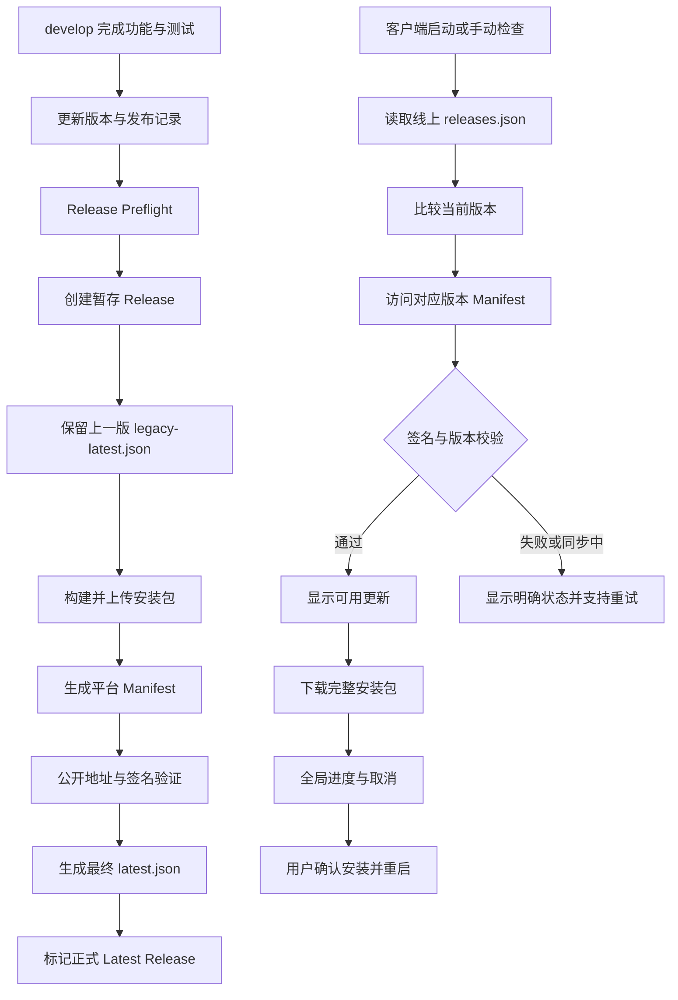

# NovelLibrary 桌面端更新与发布改造方案

## 1. 文档信息

- 状态：已实施（2026-07-17，桌面端版本为 0.5.0；IDE 插件版本独立维护）
- 适用范围：NovelLibrary Windows 桌面端更新、版本中心、GitHub Release 发布链路
- 当前版本基线：`0.3.2`
- 目标首版：在不破坏现有用户数据和旧客户端更新能力的前提下，完成发布一致性改造
- 主要参考：`jlcodes99/cockpit-tools` 的分阶段发布、平台 Manifest 和发布后验证机制

升级程序只替换应用文件；首次升级会把旧版 C 盘受管数据迁移到用户安装目录内的 `NovelLibraryData`，校验成功后清理旧版受管文件。用户后续选择的自定义数据目录和数据库路径继续受支持，并在切换成功后清理旧数据库文件。

## 2. 目标与非目标

### 2.1 目标

1. 版本记录只新增，不覆盖历史版本。
2. 发布过程中的中间状态不被旧客户端误认为最终版本。
3. 在线版本目录、GitHub Release、更新 Manifest 和安装包保持一致。
4. 安装包具备 Tauri updater 签名校验，并提供 SHA256 校验值。
5. 保留全局下载进度、取消、重试、安装并重启能力。
6. 保留历史版本更新日志和历史安装包入口。
7. 保证 TXT、EPUB、阅读进度、笔记、自定义数据目录和自定义数据库路径不受升级影响。
8. 在当前 Windows NSIS 实现中保留 macOS、Linux 和不同安装包格式的扩展边界。

### 2.2 非目标

1. 本方案使用完整安装包，不引入增量更新。
2. 本方案继续使用 Tauri updater 签名和 SHA256，不依赖 Windows Authenticode 证书。
3. 本方案不默认自动关闭应用或自动重启。
4. 本方案不改变数据库迁移方向，数据库仍只支持向上迁移。
5. 本方案不改变安装包默认位置和用户自定义安装目录行为。

## 3. 当前实现与主要问题

当前实现已经具备以下能力：

- [release-center.ts](../apps/desktop/src/services/release-center.ts) 负责在线版本清单、版本比较、下载进度和安装状态。
- [updater.rs](../apps/desktop/src-tauri/src/updater.rs) 负责固定版本更新地址、下载、取消、缓存安装包和安装。
- [releases.json](../releases/releases.json) 保存版本历史、更新说明、安装包 URL、SHA256 和数据库 Schema。
- [release-desktop.yml](../.github/workflows/release-desktop.yml) 构建 Windows NSIS 安装包，并生成签名、Manifest 和校验文件。
- 版本中心支持历史版本、下载进度、取消下载、下载完成后安装并重启。

当前仍存在的结构性风险：

1. 发布工作流是单个 Windows 任务，Release、安装包和 `latest.json` 的公开时序较紧，容易出现 GitHub Release 已存在但 Manifest 尚未完成的窗口。
2. 目前只有一个通用 `latest.json`，没有平台和安装包类型专用 Manifest。
3. 发布后主要验证本地生成物，缺少对 GitHub 公开下载地址的完整端到端验证。
4. 旧客户端只能依赖通用 `latest.json`，新客户端虽然可以使用固定版本地址，但发布链路仍应主动保护旧客户端。
5. 版本清单与更新器 Manifest 的职责已经分离，但发布脚本还没有把两者作为一个原子发布流程处理。

## 4. 目标架构



### 4.1 三类元数据的职责

| 元数据 | 作用 | 是否长期保留 |
| --- | --- | --- |
| `releases/releases.json` | 产品版本目录、历史日志、数据库兼容信息、安装包信息 | 是，版本只新增 |
| `latest-<target>.json` | 某个平台和安装包类型的 Tauri 更新入口 | 随每个 Release 保留 |
| `latest.json` | 兼容旧客户端的合并更新入口 | 每个 Release 保留 |

客户端应优先使用固定版本的目标 Manifest；`latest.json` 仅作为旧客户端兼容入口和兜底入口。

## 5. 版本目录设计

### 5.1 推荐字段

现有 `releases/releases.json` 保持为主版本目录，推荐补充以下字段：

```json
{
  "schemaVersion": 1,
  "repository": "kengqin/book",
  "latest": "0.4.0",
  "releases": [
    {
      "version": "0.4.0",
      "date": "2026-07-20",
      "title": "更新链路一致性改造",
      "channel": "stable",
      "published": true,
      "databaseSchema": 6,
      "minimumSupportedVersion": "0.3.0",
      "requiresBackup": false,
      "releaseUrl": "https://github.com/kengqin/book/releases/tag/v0.4.0",
      "installerUrl": "https://github.com/kengqin/book/releases/download/v0.4.0/NovelLibrary_0.4.0_x64-setup.exe",
      "sha256": "...",
      "sections": [],
      "upgradeNotes": []
    }
  ]
}
```

### 5.2 字段规则

- `version`：使用 SemVer，不带 `v` 前缀。
- `latest`：必须等于首条正式版本记录。
- `published`：只有 GitHub Release、安装包和 Manifest 完成公开验证后才能为 `true`。
- `databaseSchema`：记录该版本运行所需的数据库 Schema。
- `minimumSupportedVersion`：过旧客户端升级时用于提示用户先安装中间版本或导出备份。
- `requiresBackup`：为 `true` 时，安装前必须显示备份提示。
- `installerUrl`：必须是版本固定 URL，不使用 `/releases/latest/`。
- `sha256`：必须与正式 Release 中的安装包完全一致。
- `sections`：只记录公开、通用的更新内容，不写测试书籍名称、具体测试文件名或测试数据规模。
- `upgradeNotes`：说明数据库、书库、笔记和降级注意事项。

### 5.3 发布记录校验

`npm run release:validate` 应阻断以下情况：

1. 根 `package.json`、桌面端 `package.json`、Cargo、Tauri 配置和 `releases.json` 版本不一致。
2. 新版本没有位于版本记录首位。
3. 版本重复或历史版本被删除。
4. `CHANGELOG.md` 缺少对应版本。
5. 正式版本缺少安装包 URL、SHA256、更新章节或发布地址。
6. `published=true` 但 Release 尚未完成公开验证。
7. `databaseSchema` 低于上一版本，除非明确配置了人工降级方案。

## 6. Tauri 更新 Manifest 设计

### 6.1 Windows NSIS Manifest

当前 Windows 目标生成：

```text
latest-windows-x86_64-nsis.json
```

内容格式：

```json
{
  "version": "0.4.0",
  "notes": "更新链路一致性改造\n\n修复：...",
  "pub_date": "2026-07-20T10:00:00Z",
  "url": "https://github.com/kengqin/book/releases/download/v0.4.0/NovelLibrary_0.4.0_x64-setup.exe",
  "signature": "..."
}
```

### 6.2 兼容版 `latest.json`

`latest.json` 继续保留：

```json
{
  "version": "0.4.0",
  "notes": "...",
  "pub_date": "2026-07-20T10:00:00Z",
  "platforms": {
    "windows-x86_64": {
      "url": "...",
      "signature": "..."
    },
    "windows-x86_64-nsis": {
      "url": "...",
      "signature": "..."
    }
  }
}
```

旧客户端继续使用它，新客户端优先访问固定版本的目标 Manifest。增加平台时，可继续扩展：

```text
latest-darwin-aarch64.json
latest-darwin-x86_64.json
latest-linux-x86_64-deb.json
latest-linux-x86_64-appimage.json
```

### 6.3 地址规则

固定版本地址：

```text
https://github.com/kengqin/book/releases/download/v{version}/latest-windows-x86_64-nsis.json
```

旧客户端兼容地址：

```text
https://github.com/kengqin/book/releases/latest/download/latest.json
```

发布流程内部验证时必须使用固定 Tag 地址，不能依赖 GitHub `latest` 别名，避免并行任务之间互相读到错误版本。

## 7. 发布流水线改造

### 7.1 分支和版本规则

1. 功能、修复和发布准备只能从 `develop` 或功能分支开始。
2. `main` 只接受审核通过的合并结果，不直接提交代码。
3. 发布前先完成 `develop -> main` 合并，再创建对应 Tag。
4. Tag 格式为 `vX.Y.Z`，且必须与所有版本文件一致。
5. 同一个版本不得重复创建不同内容的正式 Release。

### 7.2 Job 结构

推荐将 `.github/workflows/release-desktop.yml` 拆为以下 Job：

#### `prepare-release`

- 读取版本号。
- 读取 `releases.json` 和 `CHANGELOG.md`。
- 生成中英文 Release Notes。
- 查询上一版正式 Release。
- 下载并保存上一版 `latest.json` 为 `legacy-latest.json`。
- 创建暂存 Release。
- 输出版本、Tag 和发布时间供构建与 finalize Job 使用。

#### `build-windows`

- 安装 Node、Rust 和依赖。
- 执行测试和桌面端构建。
- 构建 NSIS 安装包。
- 生成 `.sig` 和 `.sha256`。
- 将安装包和签名上传到对应 Tag 的 Release。
- 生成 `latest-windows-x86_64-nsis.json`。
- 使用 Tag 固定地址验证 Windows Manifest。

#### `finalize-release`

- 等待所有平台构建 Job 完成。
- 下载该 Release 的全部资产。
- 生成最终合并版 `latest.json`。
- 校验所有平台字段、版本号和签名。
- 上传最终 `latest.json`。
- 将 Release 设置为正式、非 Draft、非 Prerelease、Latest。
- 使用公开的 `/releases/latest/download/` 地址做最终端到端验证。

#### `upload-checksums`

- 对正式 Release 的全部安装包重新计算 SHA256。
- 生成 `SHA256SUMS.txt`。
- 上传校验文件。

### 7.3 发布时序

```text
创建暂存 Release
    -> 保留上一版 latest.json
    -> 上传当前版本安装包
    -> 上传签名
    -> 上传目标 Manifest
    -> 验证固定 Tag 地址
    -> 生成最终 latest.json
    -> 验证 latest 地址
    -> 标记正式 Release
```

任何一步失败，都不能把当前版本标记为正式版本。

### 7.4 失败和重跑规则

- `prepare-release` 重跑时，不覆盖已经完成的正式 `latest.json`。
- 安装包上传允许幂等重试，但必须校验文件名、大小和 SHA256。
- Manifest 重生成后，必须重新执行公开地址验证。
- 已经正式发布的版本禁止通过重跑 Workflow 修改版本内容；如内容有误，应发布新的修复版本。
- `releases.json` 的历史记录只能追加，不能通过 Workflow 自动删除旧记录。

## 8. 客户端更新流程

### 8.1 检查流程

```text
启动或手动检查
    -> 读取当前应用版本
    -> 请求线上 releases.json
    -> 失败则使用内置 releases.json
    -> 比较 SemVer
    -> 没有新版本：显示当前已是最新版本
    -> 有新版本：访问该版本固定 Manifest
    -> Manifest 不可用：显示“新版已发布，更新组件正在同步”
    -> Manifest 有效：显示可下载版本
```

### 8.2 下载流程

```text
available
    -> downloading
    -> downloaded
    -> installing
    -> relaunch
```

异常状态：

```text
downloading -> cancelling -> available
downloading -> error -> available
downloaded -> install error -> downloaded
installing -> relaunch error -> downloaded
```

### 8.3 全局更新任务

更新任务状态由 `release-center.ts` 统一维护，版本页面、全局状态条和导航徽标只读取同一份状态。

全局状态至少包含：

```text
stage
version
progress
message
error
downloadedBytes
totalBytes
```

要求：

1. 离开版本页面后，下载不得被页面卸载取消。
2. 关闭版本页面不等于取消下载。
3. 小叉号只取消下载，不删除历史版本信息。
4. 下载完成后全局显示“可安装并重启”。
5. 安装失败时保留已下载包，允许重新安装。
6. 重新检查时不得覆盖正在下载或等待安装的任务。

### 8.4 自动更新策略

默认策略：

```text
启动时自动检查：开启
后台定时检查：按用户设置执行，默认关闭
后台自动下载：关闭
自动安装：关闭
自动重启：关闭
用户确认下载：开启
用户确认重启：开启
```

如果用户开启“后台自动下载”，也只能在后台下载完成后等待用户重启，不能静默关闭应用或直接重启。

## 9. 安全策略

### 9.1 更新包校验

更新安装前必须完成：

1. Manifest JSON 格式校验。
2. Manifest 版本号大于当前版本。
3. 下载地址必须属于允许的 GitHub 仓库。
4. Tauri updater minisign 签名校验。
5. 下载完成后校验文件长度。
6. 发布页面提供 SHA256 校验值。

### 9.2 密钥管理

- 私钥只保存在 GitHub Actions Secret 和本地 `.release-local` 目录。
- 私钥、密码和解密文件不得提交 Git。
- 公钥随 Tauri 配置发布，可以进入客户端。
- 更换签名密钥必须增加密钥轮换方案，不能直接替换导致旧客户端无法更新。

### 9.3 下载地址限制

客户端只允许：

- `https://github.com/kengqin/book/releases/download/...`
- 已配置的官方版本清单地址

禁止从版本清单动态加载任意第三方下载地址，防止配置文件被篡改后引导下载未知文件。

## 10. 数据、安装和升级兼容性

### 10.1 安装目录

- 默认安装位置保持现有英文软件名，默认数据目录使用安装目录内的 `NovelLibraryData`。
- 用户可以继续自定义安装目录，例如 `D:\Software\NovelLibrary`。
- 更新时使用当前安装器目录，不强制改回 C 盘或默认目录。
- 安装器升级不得删除自定义数据目录和自定义数据库文件。

### 10.2 数据目录和数据库

- 首次升级从旧 `%APPDATA%\\NovelLibrary` 迁移受管数据库和配置到安装目录内的 `NovelLibraryData`。
- 数据目录仍可使用用户选择的目录；选择新位置时复制、校验、切换并清理旧数据库。
- 数据库文件路径由应用配置决定，更新程序不得自行猜测或迁移数据库。
- 数据库迁移由应用启动时执行，而不是由 NSIS 安装器执行。
- 迁移失败时必须阻止进入主界面，并提示用户恢复备份或导出日志。

### 10.3 数据库 Schema 规则

```text
旧 Schema < 当前 Schema：执行向上迁移
旧 Schema = 当前 Schema：直接使用
旧 Schema > 当前 Schema：阻止启动并提示安装较新版本
```

每次涉及数据结构的版本必须提供：

- 迁移脚本。
- 空库测试。
- 旧版本库测试。
- 重复启动幂等测试。
- 迁移失败恢复测试。

### 10.4 降级

历史版本下载不是数据库回滚。降级前必须提示：

```text
该版本可能不支持当前数据库结构，请先导出完整备份。
```

如果需要真正降级，必须采用备份恢复或独立数据库副本，不允许直接对当前数据库做反向迁移。

## 11. 错误状态和用户提示

| 场景 | 内部状态 | 用户提示 |
| --- | --- | --- |
| 版本清单网络失败 | `manifest-error` | 暂时无法连接更新服务，稍后重试 |
| 版本已发布但 Manifest 未完成 | `published-but-not-ready` | 新版已发布，更新组件正在同步 |
| Manifest 版本不匹配 | `version-mismatch` | 更新信息尚未同步完成，请稍后重试 |
| 签名校验失败 | `signature-error` | 更新包校验失败，已阻止安装 |
| 下载中取消 | `cancelled` | 下载已取消 |
| 下载失败 | `download-error` | 下载失败，可重试或打开历史版本页面 |
| 安装失败 | `install-error` | 更新包已下载，但安装失败，可重新安装 |
| 重启失败 | `relaunch-error` | 更新已安装，请手动重启应用 |
| 数据库版本过高 | `schema-too-new` | 当前版本无法读取该书库，请安装更新版本 |

错误日志应写入应用日志，并包含：

```text
stage
version
manifestUrl
installerUrl
error
retryCount
```

日志中不得写入签名私钥、密码、完整用户数据路径中的敏感信息或书籍正文内容。

## 12. 测试和验收标准

### 12.1 单元测试

- SemVer 比较。
- 版本目录 JSON 校验。
- Manifest 目标选择。
- 固定版本 URL 构造。
- Windows NSIS 目标选择。
- 无效版本号和路径逃逸拦截。
- 下载取消状态转换。
- 安装失败后状态恢复。
- `published-but-not-ready` 状态显示。

### 12.2 发布脚本测试

- 缺少签名时失败。
- 缺少安装包时失败。
- Manifest 版本和 Tag 不一致时失败。
- SHA256 不一致时失败。
- 上一版 `latest.json` 缺失时按策略阻断。
- Release 已正式发布时重跑不覆盖最终 Manifest。
- 所有公开下载地址验证通过后才能 finalize。

### 12.3 真实升级回归

至少验证以下路径：

1. `0.3.2 -> 0.4.0` 正常升级。
2. 从旧版本启动时，能看到新版已发布状态。
3. Manifest 尚未同步时，不显示“当前已是最新版本”。
4. 下载中切换到书架、工具、设置和阅读器，进度仍存在。
5. 取消后可以重新下载。
6. 下载完成后关闭版本页面，仍能从全局状态条安装。
7. 安装并重启后，读取原有 TXT、EPUB、阅读进度和笔记。
8. 自定义安装目录和自定义数据库路径保持不变。
9. 安装失败后可以重新安装，不需要重新下载或重新导入书籍。
10. 历史版本安装入口仍然可用。
11. 升级后卸载不会留下安装器管理的残留文件。

### 12.4 正式发布验收

正式 Release 必须满足：

- GitHub Release 为非 Draft、非 Prerelease。
- Tag、应用版本、版本目录版本一致。
- 安装包、`.sig`、`.sha256` 和两个 Manifest 均存在。
- 固定 Tag 地址和 `/releases/latest/` 地址均能访问。
- 签名验证通过。
- SHA256 与安装包一致。
- Release 日志没有测试书籍名称或测试数据专属描述。
- `develop` 已审核合并到 `main`。

## 13. 完整实施内容

本方案一次性完成以下全部内容：

### 13.1 发布目录与元数据

- 保留 `releases/releases.json` 作为版本、日志和数据库兼容信息的唯一来源。
- 为每个正式版本新增 `published`、`minimumSupportedVersion` 和 `requiresBackup` 校验。
- 版本记录只允许新增，禁止覆盖、删除和重复。
- 从同一份版本目录生成 GitHub Release Notes、目标 Manifest 和应用内历史记录。

### 13.2 发布流水线

- 将 Release Workflow 拆为 `prepare-release`、平台构建、`finalize-release`、公开验证和校验文件上传。
- 创建暂存 Release 时保存上一版完整 `latest.json`。
- 构建并上传 Windows NSIS 安装包、签名和 SHA256。
- 生成 `latest-windows-x86_64-nsis.json`。
- 生成兼容旧客户端的最终 `latest.json`。
- 在固定 Tag 地址和 `/releases/latest/` 地址上分别执行端到端验证。
- 只有所有验证通过后，才将 Release 标记为正式 Latest。

### 13.3 客户端更新器

- 先读取线上 `releases.json`，失败时回退到内置版本目录。
- 检测到新版本后访问该版本固定 Manifest。
- 将“版本已发布但 Manifest 尚未同步”作为独立状态展示。
- 统一检查、下载、取消、重试、安装和重启状态。
- 保留全局进度、全局取消、下载完成后的安装入口和历史版本入口。
- 下载失败时保留明确错误和重试入口。
- 安装失败时保留已下载内容，允许再次安装。

### 13.4 数据和安装兼容

- 保持用户当前安装目录，包括 `D:\Software\NovelLibrary` 等自定义目录。
- 默认数据目录跟随安装目录内的 `NovelLibraryData`；自定义数据目录和自定义数据库文件路径仍可使用。
- 升级过程先完成数据库校验和迁移，再清理旧版受管文件，不删除书库、笔记或阅读进度。
- 应用启动时执行数据库向上迁移。
- 数据库版本过高时阻止启动并提示安装较新版本。
- 降级前提示完整备份，不执行数据库反向迁移。

### 13.5 平台扩展边界

- 当前实现正式支持 Windows x86_64 NSIS。
- Manifest、目标选择、发布脚本和验证脚本均使用平台目标键设计。
- 同一套模型可以扩展 macOS、Linux Deb、RPM 和 AppImage。
- 平台扩展必须增加对应安装、权限、重启和公开地址测试，不改变 Windows 现有流程。

## 14. 预计修改文件

### 发布链路

- `.github/workflows/release-desktop.yml`
- `scripts/validate-release.mjs`
- 新增 `scripts/release/build-target-manifest.mjs`
- 新增 `scripts/release/verify-published-release.mjs`
- 新增或调整 `scripts/generate-release-notes.mjs`
- `releases/releases.json`
- `docs/桌面端发布说明.md`

### 客户端

- `apps/desktop/src/services/release-center.ts`
- `apps/desktop/src/components/GlobalUpdateStatus.vue`
- `apps/desktop/src/views/UpdatesView.vue`
- `apps/desktop/src-tauri/src/updater.rs`
- `apps/desktop/src-tauri/src/commands/update.rs`（如需要拆分命令）

### 测试

- `apps/desktop/src/services/release-center.test.ts`
- `apps/desktop/src-tauri/src/updater.rs` 内的 Rust 测试
- 新增发布脚本单元测试和公开 Release 验证测试

## 15. 发布操作清单

### 开发阶段

- [ ] 所有改动在 `develop` 或功能分支完成。
- [ ] 功能测试、迁移测试和更新器测试通过。
- [ ] 更新 `CHANGELOG.md`。
- [ ] 在 `releases.json` 首位新增版本记录。
- [ ] 确认更新说明不包含测试书籍名称和测试专属数据。
- [ ] 执行 `npm run release:validate`。

### 发布阶段

- [ ] `develop` 合并到 `main`。
- [ ] 创建并推送对应 Tag。
- [ ] 创建暂存 Release 并保存上一版 Manifest。
- [ ] 构建 NSIS 安装包。
- [ ] 生成签名和 SHA256。
- [ ] 生成固定版本 Windows Manifest。
- [ ] 验证固定 Tag 地址。
- [ ] 生成最终 `latest.json`。
- [ ] 验证 `/releases/latest/` 地址。
- [ ] 将 Release 标记为正式 Latest。
- [ ] 上传 `SHA256SUMS.txt`。

### 发布后

- [ ] 使用上一版安装包测试自动检查。
- [ ] 测试下载进度和取消。
- [ ] 测试安装并重启。
- [ ] 验证数据目录、数据库路径、TXT、EPUB、笔记和阅读进度。
- [ ] 检查 GitHub Actions 和应用日志。

## 16. 最终决策

NovelLibrary 不直接复制 `cockpit-tools` 的全部实现，而采用以下组合：

1. 保留 `releases.json` 作为产品版本和数据兼容性的唯一来源。
2. 引入固定版本、按平台的 Tauri updater Manifest。
3. 引入暂存 Release、旧 Manifest 保护和最终 finalize 流程。
4. 引入发布后的公开地址、签名和 SHA256 验证。
5. 保留用户确认下载、用户确认重启的默认策略。
6. 保留当前全局下载进度、取消、重试、历史版本和安装入口。
7. 平台目标键、Manifest 和验证逻辑从本次设计开始按跨平台方式组织，当前先启用 Windows NSIS 目标。

该方案以发布一致性、更新安全、用户数据保护和可验证性为完整交付目标。
