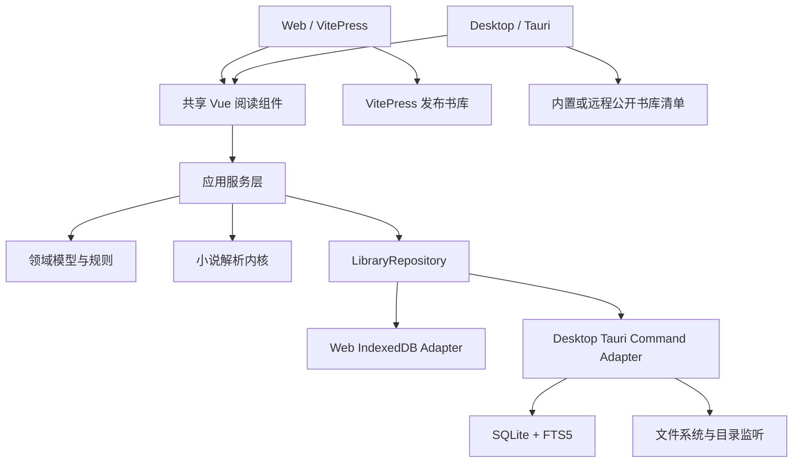

# 小说书库桌面端架构设计方案

> 状态：已确认方向，进入实施阶段
> 更新时间：2026-07-20
> 目标平台：Windows 优先，保留 macOS / Linux 扩展能力

## 1. 背景

当前项目由以下部分组成：

- `apps/web/书库/` 保存平台发布的书籍、章节、元数据和专题资源。
- `apps/web/scripts/generate-library.mjs` 在构建前扫描书库并生成发布清单。
- `apps/web/` 使用 VitePress 构建在线阅读站点。
- `apps/web/.vitepress/theme/local-library/` 提供浏览器本地 TXT 导入、章节解析、书架、阅读进度、主题和备份功能。
- 浏览器本地书架当前使用 IndexedDB 保存书籍、章节和封面。

桌面端不是单纯将网页放入安装包，而是要逐步具备稳定的本地文件管理、全文搜索、目录监听、备份恢复和系统集成能力。因此需要先将可复用业务能力从 VitePress 主题目录中抽离，再增加桌面运行时和本地持久化适配器。

## 2. 设计目标

### 2.1 产品目标

桌面端第一阶段应提供：

1. 导入 TXT 和 EPUB 小说，支持系统文件选择器和后台解析。
2. 自动识别 UTF-8、GB18030、UTF-16 LE 和 UTF-16 BE。
3. 自动解析书名、作者、卷、章节、正文和字数。
4. 展示本地书架、书籍详情、章节目录和阅读器。
5. 保存阅读进度、阅读设置、书籍主题和封面。
6. 支持书库备份、恢复和数据目录查看。
7. 支持书名、作者、章名和正文全文搜索。
8. 构建 Windows 安装包，并具备后续自动更新能力。

### 2.2 工程目标

- 在线端和桌面端共享领域模型、解析器和主要阅读组件。
- 平台差异通过接口和适配器隔离，不在 Vue 组件中散布运行环境判断。
- 桌面数据具备明确的 schema 版本和迁移机制。
- 桌面应用默认离线运行，不依赖后端服务。
- 在线书库继续使用现有 VitePress 发布链路，不因桌面端开发而改变公开 URL。
- Windows 为首个完整支持平台，但核心代码不绑定 Windows API。

### 2.3 暂不纳入首版

- 用户账号和云同步。
- 在线付费书城。
- MOBI、PDF 等复杂格式。
- AI 摘要、续写或问答。
- 跨设备实时同步。
- 插件市场和第三方脚本执行。

这些功能可以在存储模型和领域边界稳定后单独立项。

## 3. 技术选型

### 3.1 桌面运行时：Tauri 2

选择 Tauri 2，主要原因：

- 现有前端使用 Vue，可以直接复用组件和样式。
- 安装包和运行内存通常小于 Electron。
- 文件系统、系统对话框、窗口、快捷键、更新器等能力有成熟插件。
- Rust 后端适合承载 SQLite、目录监听和大文件处理。
- 安全权限可以按命令和目录收敛。

不直接选择 Electron，是因为当前项目没有必须依赖完整 Node.js 运行时的核心能力。若未来出现强 Node.js 生态依赖，可重新评估，但不作为当前预留的双运行时方案。

### 3.2 前端：Vue 3 + Vite + Vue Router

桌面端使用独立的 Vue 3 + Vite 应用，不直接使用 VitePress 作为应用框架。

原因：

- VitePress 更适合静态内容发布和文档路由。
- 桌面端需要应用级状态、动态路由、窗口生命周期和原生能力。
- 当前在线端配置了 `/book/` 基础路径，不适合作为桌面端内部路由。

### 3.3 桌面存储：SQLite + 文件目录

SQLite 保存结构化数据和章节正文：

- 书籍元数据
- 章节和卷信息
- 阅读进度
- 阅读设置
- 解析配置
- 书签和批注预留
- 全文搜索索引

文件目录保存：

- 原始导入文件副本或来源路径
- 自定义封面
- 导出备份
- 临时解析文件和缓存

首版数据库由 Rust 侧统一访问。前端只能调用有限的 Tauri command，不直接拼接 SQL。

### 3.4 Web 存储：IndexedDB

网页版继续使用 IndexedDB，保持当前纯浏览器、离线和隐私特性。IndexedDB 与 SQLite 分别实现同一个仓储接口。

## 4. 总体架构



架构分为五层：

1. **领域层**：纯 TypeScript 类型和计算规则，不依赖 Vue、浏览器、Tauri 或数据库。
2. **解析层**：处理编码识别、章节划分、清理规则和元数据推断。
3. **应用层**：组织导入、重新解析、进度保存、备份和搜索等用例。
4. **适配器层**：IndexedDB、Tauri command、VitePress 发布内容等具体实现。
5. **展示层**：Web 和 Desktop 的页面、路由和交互。

## 5. 推荐目录结构

采用 npm workspaces，避免在第一阶段额外切换包管理器。

```text
apps/
  web/
    .vitepress/
      theme/
    scripts/
    书库/
  desktop/
    src/
      app/
      pages/
      router/
      adapters/
      styles/
    src-tauri/
      src/
        commands/
        database/
        files/
        migrations/
      capabilities/
      tauri.conf.json
  mobile/
    src/
    android/
    ios/

packages/
  reader-core/
    src/
      models.ts
      repository.ts
      progress.ts
      format.ts
  novel-parser/
    src/
      parser.ts
      encoding.ts
      cleanup.ts
      metadata.ts
      worker.ts
  reader-ui/
    src/
      shelf/
      catalogue/
      reader/
      import/
      theme/
  storage-web/
    src/
      indexed-db-library-repository.ts

scripts/                     # 仓库级发布、校验与平台自动化脚本
docs/                        # 架构、数据和发布文档
```

Web 端已迁入 `apps/web/`，与 Desktop、Mobile 形成一致的应用层边界；共享解析、阅读和存储能力继续由 `packages/` 提供。

## 6. 领域模型

### 6.1 核心类型

```ts
export interface Book {
  id: string
  title: string
  author: string
  description: string
  source: BookSource
  chapterCount: number
  totalWords: number
  createdAt: number
  updatedAt: number
}

export interface Chapter {
  id: string
  bookId: string
  number: number
  originalLabel: string
  title: string
  volume: string
  content: string
  wordCount: number
}

export interface ReadingProgress {
  bookId: string
  chapterNumber: number
  chapterProgress: number
  overallProgress: number
  scrollAnchor?: string
  updatedAt: number
}

export type BookSource =
  | { kind: 'local-file'; path?: string; sourceName: string; sourceSize: number }
  | { kind: 'published'; slug: string; version?: string }
```

公开书库和本地导入书籍使用统一的展示模型，但数据来源需要保留明确类型，避免以后同步、更新和删除语义混淆。

### 6.2 仓储接口

```ts
export interface LibraryRepository {
  listBooks(query?: BookQuery): Promise<Book[]>
  getBook(id: string): Promise<Book | undefined>
  listChapters(bookId: string): Promise<ChapterSummary[]>
  getChapter(bookId: string, number: number): Promise<Chapter | undefined>
  saveImportedBook(input: SaveImportedBookInput): Promise<Book>
  updateBook(input: UpdateBookInput): Promise<Book>
  deleteBook(id: string): Promise<void>
  getProgress(bookId: string): Promise<ReadingProgress | undefined>
  saveProgress(progress: ReadingProgress): Promise<void>
  search(query: SearchQuery): Promise<SearchResult[]>
}
```

备份、恢复和存储统计属于平台能力，不强行塞入基础仓储：

```ts
export interface LibraryMaintenanceService {
  exportBackup(target?: string): Promise<BackupResult>
  importBackup(source: string): Promise<ImportBackupResult>
  getStorageStats(): Promise<StorageStats>
}
```

## 7. 桌面数据库设计

### 7.1 表结构

```sql
CREATE TABLE books (
  id TEXT PRIMARY KEY,
  title TEXT NOT NULL,
  author TEXT NOT NULL DEFAULT '',
  description TEXT NOT NULL DEFAULT '',
  source_kind TEXT NOT NULL,
  source_path TEXT,
  source_name TEXT NOT NULL DEFAULT '',
  source_size INTEGER NOT NULL DEFAULT 0,
  source_fingerprint TEXT,
  encoding TEXT,
  chapter_count INTEGER NOT NULL DEFAULT 0,
  total_words INTEGER NOT NULL DEFAULT 0,
  parse_options_json TEXT NOT NULL,
  theme_json TEXT NOT NULL,
  created_at INTEGER NOT NULL,
  updated_at INTEGER NOT NULL,
  last_read_at INTEGER NOT NULL
);

CREATE TABLE chapters (
  id TEXT PRIMARY KEY,
  book_id TEXT NOT NULL REFERENCES books(id) ON DELETE CASCADE,
  number INTEGER NOT NULL,
  original_label TEXT NOT NULL,
  title TEXT NOT NULL,
  volume TEXT NOT NULL DEFAULT '',
  content TEXT NOT NULL,
  word_count INTEGER NOT NULL DEFAULT 0,
  UNIQUE(book_id, number)
);

CREATE TABLE notes (
  id TEXT PRIMARY KEY,
  title TEXT NOT NULL DEFAULT '',
  content_html TEXT NOT NULL DEFAULT '',
  content_text TEXT NOT NULL DEFAULT '',
  is_pinned INTEGER NOT NULL DEFAULT 0,
  created_at INTEGER NOT NULL,
  updated_at INTEGER NOT NULL
);

CREATE TABLE reading_progress (
  book_id TEXT PRIMARY KEY REFERENCES books(id) ON DELETE CASCADE,
  chapter_number INTEGER NOT NULL,
  chapter_progress REAL NOT NULL,
  overall_progress REAL NOT NULL,
  scroll_anchor TEXT,
  updated_at INTEGER NOT NULL
);

CREATE TABLE settings (
  key TEXT PRIMARY KEY,
  value_json TEXT NOT NULL,
  updated_at INTEGER NOT NULL
);

CREATE VIRTUAL TABLE chapters_fts USING fts5(
  book_id UNINDEXED,
  chapter_id UNINDEXED,
  title,
  content,
  tokenize = 'unicode61'
);
```

### 7.2 数据迁移

- 使用递增的 schema version。
- 每个版本只执行一次事务迁移。
- 启动失败时不自动删除数据库。
- 迁移前创建轻量备份或 SQLite snapshot。
- 应用版本回退时提示数据库版本不兼容，不尝试降级写入。

## 8. 小说解析设计

当前 Web Worker 中的解析算法拆成纯函数：

```ts
parseNovel(buffer, filename, options, onProgress): Promise<ParseResult>
```

平台包装层分别为：

- Web：Dedicated Worker 调用纯解析器，避免阻塞页面。
- Desktop 首版：Vite Worker 调用同一解析器。
- Desktop 后续：当超大文件成为明确性能问题时，再增加 Rust 流式解析实现。

首版不同时维护 TypeScript 和 Rust 两套解析规则，避免章节识别结果漂移。

解析结果必须满足：

- 章节编号在单本书内唯一且稳定。
- 重新解析尽量保留书籍 ID、主题和阅读进度。
- 编码检测结果、解析规则和警告可以回看。
- 保存前允许用户预览识别出的书名、作者和章节数。

## 9. UI 与路由

### 9.1 桌面路由

```text
/library                         本地书架
/book/:bookId                    书籍详情与目录
/read/:bookId/:chapterNumber     阅读器
/search                          全文搜索
/tools                           工具库
/tools/notes                     本地笔记
/settings                        应用和存储设置
```

桌面端使用 Vue Router。书籍和章节标识放在路由参数中，弹窗状态和临时导入步骤不进入持久路由。

### 9.2 共享 UI 原则

可以共享：

- 阅读器正文排版
- 字号、行距和配色控制
- 章节目录
- 书籍卡片
- 导入步骤主体
- 主题编辑器

不直接共享：

- VitePress 导航和布局槽位
- `withBase` 路径处理
- 浏览器 History 手工操作
- Tauri 标题栏、系统菜单和窗口控制
- 平台专属文件选择器

组件通过 props、events 和 composable 使用应用服务，不直接 import IndexedDB 或 Tauri API。

## 10. 原生能力边界

Tauri command 首版控制在以下范围：

- `select_novel_files`
- `read_novel_file`
- `save_imported_book`
- `list_books`
- `get_book`
- `list_chapters`
- `get_chapter`
- `save_reading_progress`
- `search_library`
- `export_backup`
- `import_backup`
- `open_data_directory`

约束：

- 不开放任意 shell 命令。
- 不接受前端传入任意 SQL。
- 文件访问限定为用户明确选择的文件、应用数据目录和用户配置的书库目录。
- 所有路径在 Rust 侧规范化和校验。
- 删除操作需要明确确认，并使用数据库事务。

## 11. Web 与桌面数据兼容

当前网页版已有 JSON 备份格式。桌面端不会直接把 IndexedDB 内部结构作为长期格式，而是定义独立的版本化交换格式：

```json
{
  "format": "novel-library-backup",
  "version": 2,
  "createdAt": "2026-07-15T00:00:00.000Z",
  "books": [],
  "chapters": [],
  "progress": [],
  "assets": []
}
```

兼容策略：

1. 桌面端支持导入当前 Web `version: 1` 备份。
2. Web 和 Desktop 后续都导出 `format + version` 明确的新格式。
3. 新格式导入器按版本迁移，不依赖当前数据库表结构。
4. 封面资源采用文件条目或 Base64，具体由导出目标决定。

## 12. 公开书库集成

`apps/web/书库/` 仍是平台公开内容的源数据。

桌面端对公开书库采用 provider 设计：

```ts
export interface PublishedLibraryProvider {
  getCatalog(): Promise<PublishedBookSummary[]>
  getBook(id: string): Promise<PublishedBook>
  getChapter(bookId: string, chapterId: string): Promise<PublishedChapter>
}
```

实现顺序：

1. 首版可将生成后的公开书库清单和章节资源随应用打包。
2. 后续增加远程静态清单，从 GitHub Pages 获取内容更新。
3. 公开书籍下载到本地后再进入统一书架，但保留 `published` 来源标识。

不要让桌面端直接解析 VitePress HTML 页面作为数据源。

## 13. 安全与隐私

- 本地书籍默认不上传。
- UI 明确展示数据保存位置。
- 日志不记录小说正文。
- 崩溃日志默认只包含错误栈、应用版本和系统信息。
- CSP 禁止不必要的远程脚本。
- Tauri capability 只启用实际使用的插件权限。
- 远程公开书库内容视为不可信输入，正文按纯文本渲染。
- 备份导入需要校验格式、版本、数量和总体积。

## 14. 构建与发布

### 14.1 本地命令目标

```bash
npm run web:dev
npm run web:build
npm run desktop:dev
npm run desktop:build
npm run test
npm run typecheck
```

### 14.2 Windows 发布

首选产物：

- NSIS 安装包，面向普通用户。
- MSI 可作为企业环境补充。
- 调试阶段可保留便携构建，但不作为唯一发布形式。

GitHub Actions 后续负责：

1. 安装 Node.js 和 Rust。
2. 执行类型检查、单元测试和 Web 构建。
3. 构建 Tauri Windows 安装包。
4. 上传到 GitHub Release。
5. 生成更新清单。

自动更新使用 Tauri updater 签名。私钥仅保存在发布环境和 GitHub Actions Secret 中，不提交到仓库；应用配置只保存公钥。

应用内版本中心读取 `releases/releases.json`，在线时优先读取 GitHub 主分支的最新清单，离线时使用随应用打包的清单。最新版由 updater 下载并原地安装，历史版本则打开对应 GitHub Release 安装包；降级安装必须提示数据库 schema 兼容风险。

## 15. 测试策略

### 15.1 单元测试

- 中文和阿拉伯数字章节识别。
- 特殊章节名、卷名和错误断行处理。
- UTF-8、GB18030、UTF-16 编码识别。
- 广告规则清理。
- 阅读总进度计算。
- 备份格式迁移。

### 15.2 集成测试

- 导入 TXT 后书籍、章节和字数一致。
- 重新解析保留书籍 ID、主题和合理的阅读位置。
- SQLite 事务失败不会留下半本书。
- 删除书籍级联删除章节、进度和全文索引。
- Web IndexedDB 适配器行为与仓储契约一致。

### 15.3 桌面验收

- Windows 安装、启动、升级和卸载正常。
- 中文路径、空格路径和超长书名可正常导入。
- 拖入多个 TXT 时有明确结果。
- 关闭重启后书架和阅读进度保留。
- 离线环境可以完成全部本地阅读功能。
- 4K、1080p 和常见笔记本分辨率下无布局遮挡。

## 16. 实施阶段

### 阶段 A：共享内核

工作内容：

- 建立 npm workspaces。
- 新建 `reader-core` 和 `novel-parser`。
- 抽取类型、格式化、阅读进度和解析算法。
- 为解析器增加核心测试。
- 现有 Web Worker 改为调用共享解析器。

验收标准：

- Web 导入结果与改造前一致。
- `npm run web:build` 成功。
- 共享包不依赖 Vue、VitePress、IndexedDB 或 Tauri。

### 阶段 B：Web 存储与 UI 解耦

工作内容：

- 定义 `LibraryRepository`。
- 将现有 `db.ts` 改为 IndexedDB adapter。
- 拆分本地书架页面中的数据访问、路由和视图状态。
- 提取可共享阅读组件。

验收标准：

- Web 本地书架功能不回归。
- Vue 组件不直接调用 `openDB`。
- 阅读组件不依赖 `vitepress`。

### 阶段 C：桌面骨架

工作内容：

- 创建 Vue + Vite + Tauri 2 应用。
- 建立桌面路由和基础窗口布局。
- 接入共享 UI 和解析器。
- 建立最小 Tauri capability。

验收标准：

- `npm run desktop:dev` 可以启动桌面窗口。
- 书架、书籍详情和阅读器路由可以切换。
- 不需要联网即可运行。

### 阶段 D：SQLite 与完整本地流程

工作内容：

- 建立数据库迁移和仓储 command。
- 实现文件选择、拖放导入和重新解析。
- 实现阅读进度、主题、删除、备份和恢复。
- 实现 FTS5 全文搜索。

验收标准：

- 导入、关闭、重启、继续阅读链路完整。
- 备份可以在新数据目录中恢复。
- 搜索结果可以定位并打开对应章节。

### 阶段 E：发布

工作内容：

- Windows 图标、应用信息和安装器配置。
- CI 构建和 GitHub Release。
- 自动更新签名配置。
- 安装、覆盖升级和卸载验证。

验收标准：

- 可产出可安装的 Windows 包。
- 新版本可以从旧版本升级且数据不丢失。
- 发布文档包含版本、产物和校验信息。

## 17. 首轮实施决策

以下决策作为当前实施基线：

1. 使用 Tauri 2，不建立 Electron 双实现。
2. 继续使用 npm，并启用 npm workspaces。
3. 在线端暂不搬目录，优先降低回归风险。
4. 先抽纯 TypeScript 解析内核，不提前重写为 Rust。
5. 桌面端从第一版开始使用 SQLite，不将 WebView IndexedDB 作为正式桌面存储。
6. 首版只支持 TXT，其他格式后续通过独立 importer 扩展。
7. 本地优先、无后端依赖、默认不上传用户书籍。

## 18. 下一步

立即进入阶段 A：

1. 配置 npm workspaces。
2. 新建共享领域包和解析包。
3. 将当前 `types.ts` 中的通用类型迁入共享领域包。
4. 将 `parser.worker.ts` 拆为纯解析函数和 Worker 适配器。
5. 增加解析器测试并验证现有 VitePress 构建。

## 19. 当前实施进度

截至 2026-07-15：

- 阶段 A 已完成：建立 npm workspaces，抽取 `reader-core` 和 `novel-parser`，Web Worker 已接入共享解析器。
- 阶段 B 的存储边界已完成：建立 `LibraryRepository` 契约和 `storage-web` IndexedDB 适配器。
- 阶段 C 骨架已完成：建立 Vue 3、Vue Router 和 Tauri 2 桌面应用，前后端 command 可以通信。
- 已建立共享内核、解析器和 IndexedDB 仓储测试，当前共 7 项测试。
- 在线端生产构建、桌面前端构建和 Rust `cargo check` 均已通过。
- Windows 桌面开发窗口已实际启动并完成空书架、导航、设置状态和图标检查。

截至当前，阶段 D 与首个 Windows Release 已完成：

- SQLite schema v5 与自动迁移已启用，Schema 3 / 4 书库可原地升级。
- 默认数据目录为 `%APPDATA%\NovelLibrary`，设置页支持自定义数据目录和数据库文件。
- TXT 与 EPUB 导入、书架、分卷目录、阅读、章内进度、搜索和删除链路已接通。
- EPUB2 / EPUB3 使用独立 Worker 解析安全结构化块，支持 OPF、NAV / NCX、封面、插图和超长网文章节。
- JSON 备份恢复已接通。
- 工具库和本地富文本笔记已接通，支持 CRUD、搜索、置顶、复制、自动保存和多格式导入导出。
- NSIS 安装包已生成。

后续增强项包括目录监听、书签批注、独立封面编辑、FTS5 大书库索引和自动更新签名。
