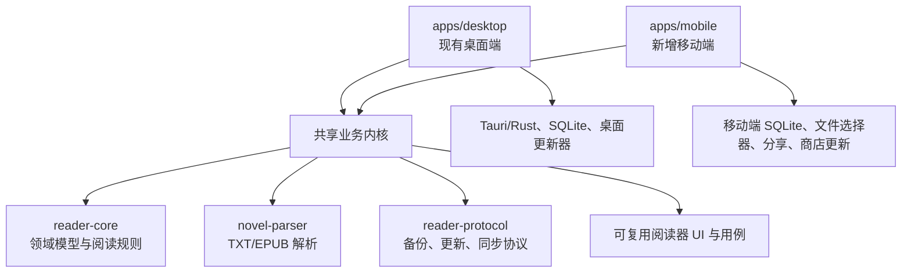

# 小说书库 Android / iOS 架构实施方案

> 状态：移动端本地功能和 Android Debug/Release 工程已完成，待正式签名与商店参数
> 适用版本：桌面端 0.6.x 及移动端首版
> 更新时间：2026-07-19

## 1. 目标与边界

本方案的目标是在保留现有 Windows/macOS/Linux 桌面端的前提下，新增 Android 和 iOS 应用。桌面端继续使用现有的 Vue 3 + Vite + Tauri 2 + Rust + SQLite 架构，不迁移、不替换、不改变现有桌面端发布链路。

移动端首版提供书库的核心阅读能力：

- 书架、书籍详情、卷章目录和阅读器
- TXT / EPUB 导入
- 阅读进度、字号、行距、主题和夜间模式
- 书名、作者、章节和正文搜索
- 本地备份、恢复和存储统计
- 应用版本更新中心和书库内容更新入口

已确认的首版产品决策：

- 首版采用手动备份/恢复，不做账号和云同步
- Android 支持 APK 直装渠道
- iOS 接入 TestFlight 测试渠道，正式版本仍通过 App Store
- 同时支持完整书库备份和单本书导出
- 移动端正式包名为 `com.kengqin.novellibrary.mobile`

首版不纳入工具库、笔记、IDE 插件、桌面窗口/托盘、数据目录切换和桌面安装包更新。工具能力继续留在桌面端。

## 2. 总体架构



代码组织保持 monorepo：

```text
apps/
  desktop/                  # 保持现状
  mobile/                   # 新增移动端应用壳

packages/
  reader-core/              # 已有：领域模型、阅读进度、主题
  novel-parser/             # 已有：TXT/EPUB 解析内核
  reader-protocol/          # 已有：桥接协议；新增更新协议
  storage-web/              # 已有：IndexedDB
  storage-desktop/          # 现有桌面端 Rust 命令适配
  storage-mobile/           # 第二阶段：移动端 SQLite 适配
  reader-ui/                # 第二阶段：抽取跨端阅读器组件
```

移动端有独立的路由、导航和原生适配器。桌面页面不会通过 CSS 缩小后直接作为手机 UI。

## 3. 技术选型

### 3.1 移动端应用壳

移动端已选用 Capacitor 7 + Vue 3。原因是文件选择、分享、SQLite、Android APK 安装、App 生命周期和 iOS 工程生成能力更适合当前首版目标。桌面端仍然保持 Tauri，不与移动端共用原生壳。

不在首版采用 Flutter 或 React Native，避免为阅读器、解析器和状态层重新维护一套实现。

### 3.2 数据存储

移动端采用本地优先：原生 Android/iOS 使用 `@capacitor-community/sqlite` 保存书籍元数据、章节、阅读进度和搜索数据；浏览器预览和自动化测试使用 IndexedDB 适配器。封面、原始文件和备份暂存于应用沙盒文件目录。Vue 页面不直接拼接 SQL，统一通过移动端仓储适配器访问。

备份首版同时提供两种粒度：完整书库备份，以及选定单本书（元数据、章节、封面和阅读设置）导出。备份格式带版本号，恢复时先校验格式再使用事务写入。

移动端导入流程为“系统文件选择器/分享菜单 → 复制到沙盒 → 后台解析 → 事务写入 SQLite”。不依赖桌面端的绝对路径和目录监听。

### 3.3 更新中心

更新中心分为两个独立能力：

1. **应用二进制更新**：桌面端继续使用 Tauri Updater；Android 支持 APK 直装，安装前校验 HTTPS、版本号、文件摘要和应用签名；iOS 测试版跳转 TestFlight，正式版跳转 App Store，下载和安装由系统管理。
2. **书库内容更新**：书籍清单、封面、元数据和公开章节由应用内部下载，可在 Android/iOS 共用内容更新协议。

不通过远程脚本热更新来绕过 App Store 审核。远程内容可以更新，应用核心功能和可执行代码必须随 APK/App Store/TestFlight 版本发布。

### 3.4 EPUB 富文本

“保留 EPUB 富文本”指保留 EPUB 章节中的结构和安全样式，而不是把 EPUB 当成纯文本抹平格式。移动端需要继续支持：标题层级、粗体、斜体、段落、引用、列表、图片、链接和章节内 CSS 的有限映射；同时必须清理脚本、外部网络资源、危险 URL 和不受控样式，沿用桌面端的 HTML 清洗边界。TXT 仍然按纯文本段落渲染。

## 4. 领域与协议设计

所有跨端对象使用稳定 UUID，并保留 `createdAt`、`updatedAt`、`lastReadAt`。阅读进度保留章节号、章节内进度和可选阅读锚点，为以后跨设备同步做准备。

应用更新协议至少包含：

- 当前版本和最新版本
- 发布渠道（stable/preview）
- 发布时间、标题、分组更新说明
- 最低支持版本
- 商店地址（Android/iOS）
- 内容更新清单地址

更新协议只负责校验和描述更新，不负责决定平台安装方式。安装动作由平台适配器实现。

## 5. 移动端导航与交互

底部导航固定为：

```text
书架 ｜ 搜索 ｜ 设置
```

阅读器使用独立全屏路由：点击中部显示控制栏，左右滑动切章，底部弹层显示目录、字体、行距和主题设置。所有页面处理刘海屏安全区、横竖屏切换、系统返回键和应用进入后台事件。

移动端设置保留主题、解析默认值、备份恢复、存储统计和版本信息；删除“数据目录切换”和桌面专用安装选项。

## 6. 实施阶段

### 阶段 A：基础协议与应用骨架（当前阶段）

- 建立移动端独立目录和构建边界
- 在 `reader-protocol` 增加版本比较、更新清单和平台更新动作协议
- 为更新协议增加单元测试和恶意数据校验
- 形成移动端页面/原生能力适配清单

### 阶段 B：本地书库

- 移动端 SQLite schema、迁移和仓储实现
- TXT/EPUB 后台解析与可取消任务
- 书架、详情、目录、阅读器和进度保存
- 文件选择器、分享导入和封面缓存

### 阶段 C：移动端更新中心

- Android Play 更新适配
- iOS App Store 跳转适配
- 应用版本清单缓存、失败重试和离线降级
- 书库内容更新下载器

### 阶段 D：质量与发布

- Android 真机和低内存测试
- iOS 真机、后台恢复和安全区测试
- 大文件解析、数据库迁移、备份恢复和断点场景测试
- Play Internal Testing、TestFlight 和正式商店发布

## 7. 测试基线

每次提交必须通过：

- `npm test`
- 所有共享包 TypeScript 类型检查
- `apps/desktop` 原有构建
- `apps/mobile` 构建
- 更新清单的非法版本号、错误平台、错误 URL、缺失字段和旧缓存测试

移动端真机验收必须覆盖：首次安装、导入 TXT、导入 EPUB、杀后台后恢复、横竖屏、系统返回、断网阅读、备份恢复、低存储空间、App Store/Google Play 更新跳转。

## 8. 风险与处理

| 风险 | 处理方式 |
|---|---|
| iOS 无法自行安装新版本 | 只做 App Store 跳转，自动更新交给系统 |
| 大 TXT/EPUB 占用过多内存 | Worker/原生后台任务，限制单次内存，必要时流式解析 |
| 中文全文搜索分词效果不稳定 | 抽象搜索接口，首版可使用规范化匹配，后续替换 SQLite tokenizer |
| 桌面和移动数据格式漂移 | 备份格式版本化、数据库 migration、协议单元测试 |
| Tauri Mobile 插件不完整 | 保持移动端适配器隔离，必要时切换 Capacitor，不改领域层 |

## 9. 仍需后续确认的工程参数

产品方向已经确定，下面这些是进入真实打包和发布前才需要提供的工程参数：

1. Android APK 的正式签名密钥及安全保管位置。
2. iOS Apple Developer 团队、Bundle ID 注册和 TestFlight 团队成员。
3. 正式 App Store / TestFlight 链接，以及 APK 发布地址。
4. 移动端版本清单和书库内容清单的正式托管地址。
