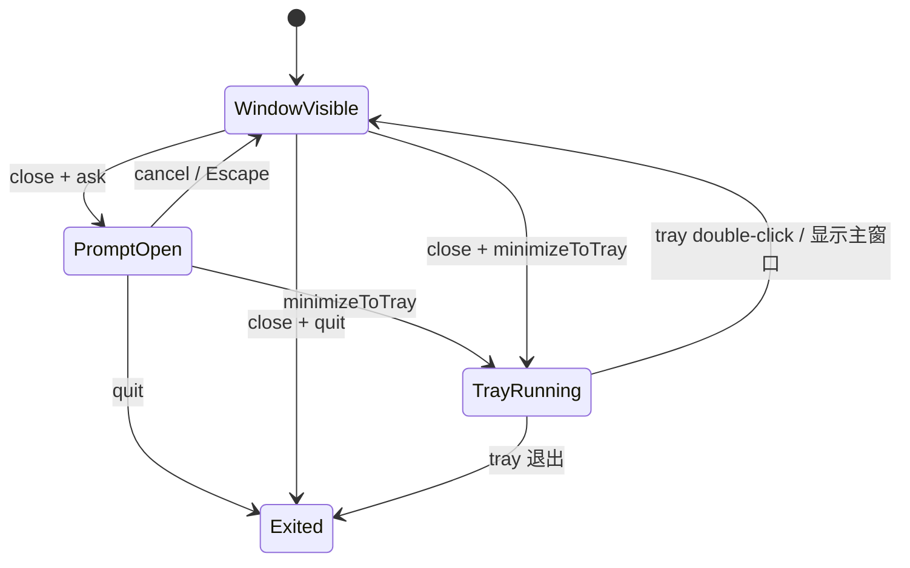

# 小说书库窗口关闭与托盘技术方案

> 状态：已实现，等待发布
> 更新时间：2026-07-17
> 适用端：Windows 桌面端

## 1. 目标

桌面端主窗口收到关闭请求时，允许用户选择“缩小到托盘”或“直接退出”。用户可以在首次询问弹框中记住选择，也可以随时在设置页修改关闭行为。

支持三种持久化状态：

| 配置值 | 设置页文案 | 关闭窗口行为 |
| --- | --- | --- |
| `ask` | 每次询问 | 阻止关闭并显示选择弹框 |
| `minimizeToTray` | 缩小到托盘 | 隐藏主窗口，保留桌面 Bridge 和托盘进程 |
| `quit` | 直接退出 | 退出桌面应用和 Bridge |

默认值为 `ask`。弹框中未勾选“记住我的选择”时，只执行本次选择，不改变持久化配置。

## 2. 模块边界

- `apps/desktop/src-tauri/src/close_behavior.rs`：原生窗口关闭拦截、偏好持久化、托盘菜单和 Tauri 命令。
- `apps/desktop/src-tauri/src/lib.rs`：注册状态、托盘、命令和窗口事件处理器。
- `apps/desktop/src/components/CloseBehaviorDialog.vue`：全局关闭选择弹框。
- `apps/desktop/src/services/desktop-library.ts`：前端类型和 Tauri IPC 封装。
- `apps/desktop/src/views/SettingsView.vue`：关闭行为下拉框。

## 3. 生命周期



原生层始终拦截普通的主窗口 `CloseRequested`，避免 WebView 尚未处理事件时窗口已经销毁。`force_exit` 仅用于托盘退出和直接退出路径，确保应用退出不会再次进入关闭询问。

`prompt_open` 保证连续点击关闭按钮时只发送一次 `close-behavior-requested`。弹框取消或完成选择后重置该状态。

## 4. 数据持久化

偏好保存在：

```text
%APPDATA%\NovelLibrary\app-settings.json
```

文件格式：

```json
{
  "closeBehavior": "minimizeToTray"
}
```

配置目录不存在时自动创建。文件缺失、JSON 无法解析或字段无效时回退到 `ask`，不阻止应用启动。只有文件写入成功后才更新内存状态，前端保存失败时保留当前选择并显示错误。

## 5. IPC 契约

| 名称 | 方向 | 用途 |
| --- | --- | --- |
| `get_close_behavior` | Web -> Rust | 获取当前关闭行为 |
| `set_close_behavior` | Web -> Rust | 从设置页保存关闭行为 |
| `cancel_close_behavior_prompt` | Web -> Rust | 取消弹框并允许下次再次询问 |
| `resolve_close_behavior` | Web -> Rust | 执行本次选择，并按 `remember` 决定是否保存 |
| `close-behavior-requested` | Rust -> Web | 通知全局弹框显示 |

`resolve_close_behavior` 不接受 `ask` 作为执行动作，只接受 `minimizeToTray` 或 `quit`。

## 6. 托盘行为

- 托盘图标复用桌面应用图标，提示文字为“小说书库”。
- 左键双击托盘图标恢复、取消最小化并聚焦主窗口。
- 右键菜单提供“显示主窗口”和“退出”。
- “缩小到托盘”只隐藏窗口，不停止 Bridge，IDE 插件仍可访问桌面书库和同步阅读进度。
- 托盘“退出”绕过关闭询问并终止整个应用。

## 7. 验收清单

1. 首次启动默认为“每次询问”，关闭窗口显示选择弹框。
2. 取消按钮、右上角关闭按钮和 `Escape` 均关闭弹框但保留主窗口。
3. 不勾选记忆时，两种动作只对本次生效，下次仍询问。
4. 勾选记忆并缩小到托盘后，下次关闭直接隐藏窗口。
5. 托盘双击和“显示主窗口”均能恢复并聚焦窗口。
6. 设置页可在三种行为间反复切换，重启后保持最后一次设置。
7. 直接退出和托盘“退出”均终止桌面进程及 Bridge。
8. 配置文件损坏或缺失时应用正常启动并回退到“每次询问”。

## 8. 自动化验证

- Rust 单元测试验证 camelCase IPC 序列化以及同一配置文件的重复覆盖写入。
- `cargo test`、`cargo fmt --check` 验证原生实现。
- `npm run desktop:web:build`、`npm test` 验证前端类型与现有功能回归。
- Release 可执行文件进行关闭弹框、托盘恢复、偏好重启和退出流程的 Windows 实机验证。
